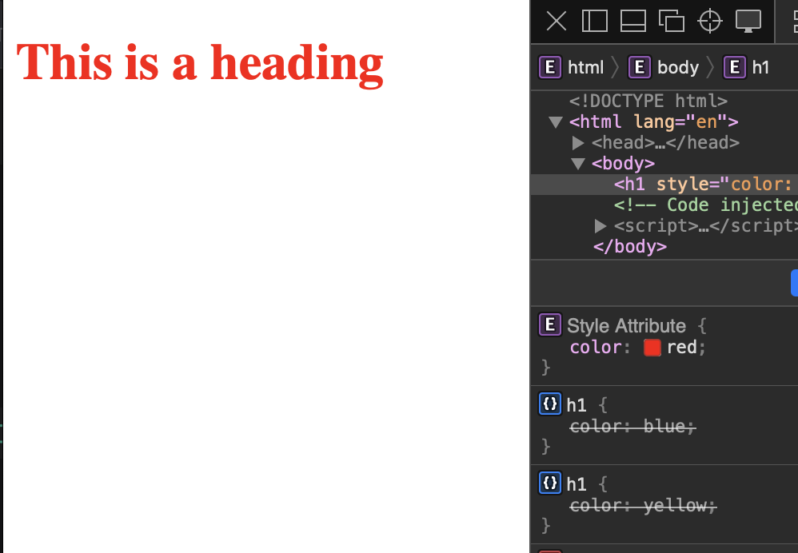
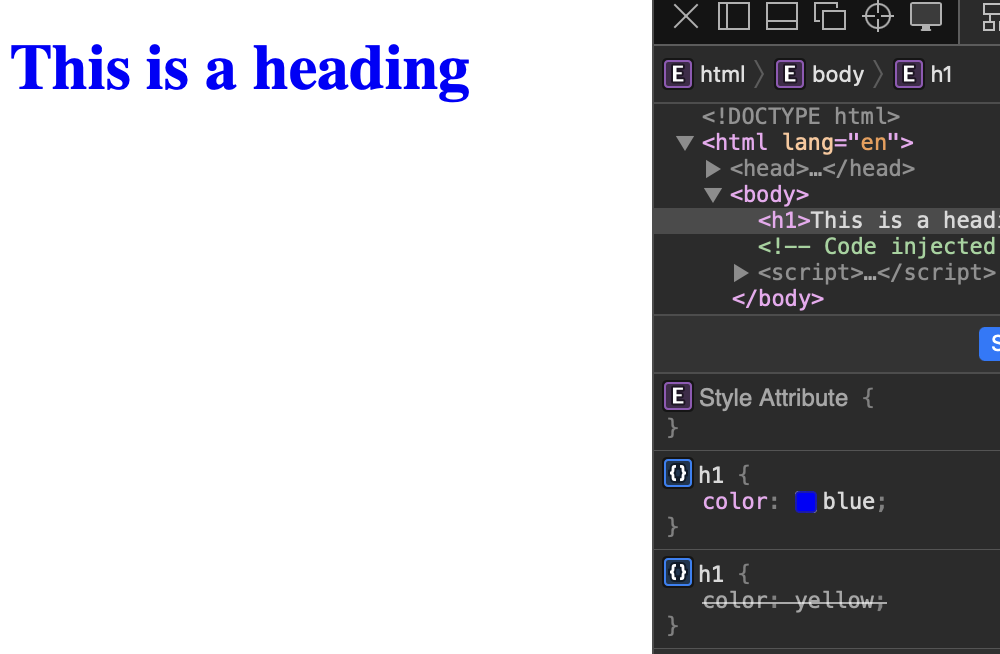
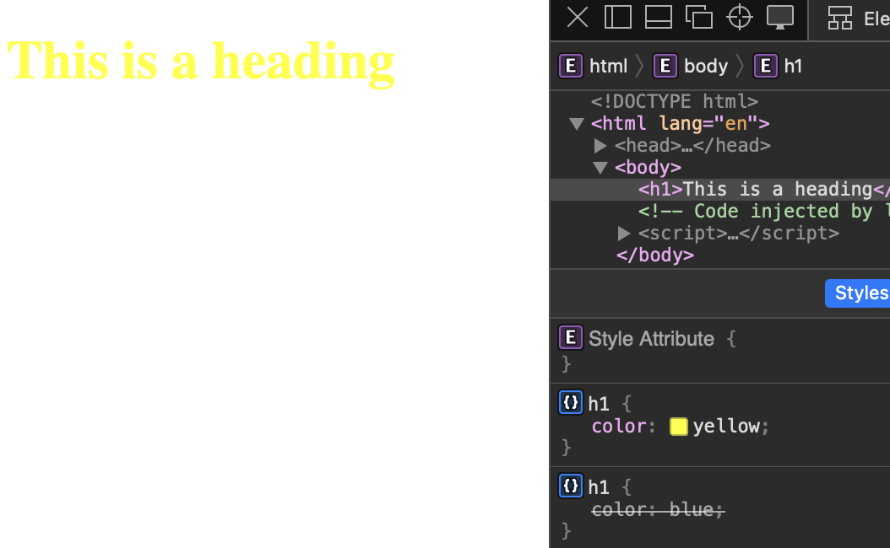

# How To Add CSS

Có 3 cách để sử dụng `css` trong `html`

- External CSS
- Internal CSS
- Inline CSS

## External CSS

Gom nhóm tất cả `css` vào trong 1 file riêng biệt.

Tạo file `.css`, để viết tất cả css trong đó. Ở file `HTML` sẽ cần dùng thẻ `<link>` để nhúng vào.

```css title="index.css"
h1 {
  color: red;
}
```

```html title="File html"
<!DOCTYPE html>
<html>
  <head>
    <link rel="stylesheet" href="index.css" />
    <!-- Nhúng file index.css vào trong html -->
  </head>
  <body>
    <h1>This is a heading</h1>
    <p>This is a paragraph.</p>
  </body>
</html>
```

:::tip[TIP]
Khuyến khích lựa chọn viết `css` theo cách này, dễ dàng bảo trì, debug và phát triển.
:::

## Internal CSS

Viết `css` bên trong thẻ `<style>` trong `<head>`, nội dung code `css` và `html` trong cùng 1 file.

```html title="Example"
<!DOCTYPE html>
<html>
  <head>
    <style>
      h1 {
        color: red;
      }
    </style>
    <!-- Viết css ngay trong thẻ style -->
  </head>
  <body>
    <h1>This is a heading</h1>
    <p>This is a paragraph.</p>
  </body>
</html>
```

## Inline CSS

Viết trực tiếp style bằng thuộc tính `style` trong thẻ `html`.

```html title="Example"
<h1 style="color:red;text-align:center;">Title</div>
```

### Priority

Mức độ ưu tiên `CSS` của các cách.

#### Case 1

`Dùng cả 3 sách css cùng 1 lúc`

```html title="Example"
<!DOCTYPE html>
<html>
  <head>
    <link rel="stylesheet" href="index.css" />
    <!-- External color: yellow; -->

    <style>
      h1 {
        color: blue;
      }
    </style>
    <!-- Internal color: blue; -->
  </head>
  <body>
    <h1 style="color:red;">This is a heading</h1>
    <!-- Inline color: red; -->
  </body>
</html>
```



`Inline css` với mức độ ưu tiên cao nhất, sẽ ghi đè hết các cách css còn lại.

#### Case 2

`Không dùng Inline css, chỉ dùng External và Internal`

1. Đặt `Internal` sau `External`;

```html title="Example"
<!DOCTYPE html>
<html>
  <head>
    <link rel="stylesheet" href="index.css" />
    <!-- External color: yellow; -->

    <style>
      h1 {
        color: blue;
      }
    </style>
    <!-- Internal color: blue; -->
  </head>
  <body>
    <h1>This is a heading</h1>
  </body>
</html>
```



Style trong `Internal` được ưu tiên hơn trước `External`.

2. Đặt `External` sau `Internal`;

```html title="Example"
<!DOCTYPE html>
<html>
  <head>
    <style>
      h1 {
        color: blue;
      }
    </style>
    <!-- Internal color: blue; -->

    <link rel="stylesheet" href="index.css" />
    <!-- External color: yellow; -->
  </head>
  <body>
    <h1>This is a heading</h1>
  </body>
</html>
```



Style trong `External` được ưu tiên hơn trước `Internal`.

:::warning[Lưu ý]
Khi dùng `External`, `Internal` để css, giá trị css sẽ ưu tiên lấy giá trị css gần nhất được áp dụng cho phần tử đó.
:::
