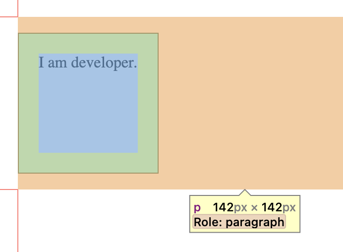
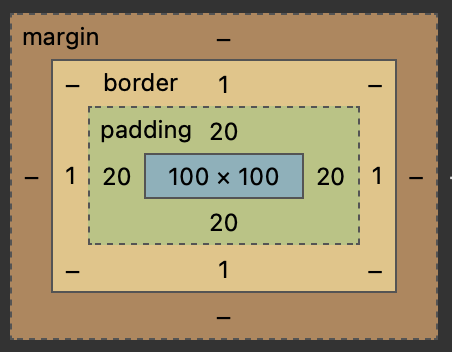
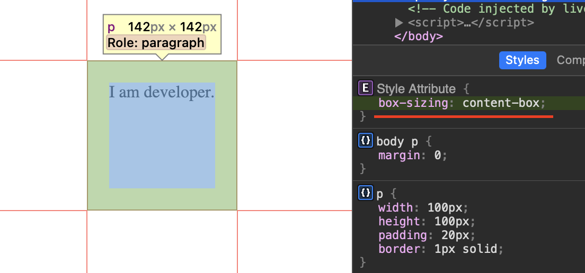
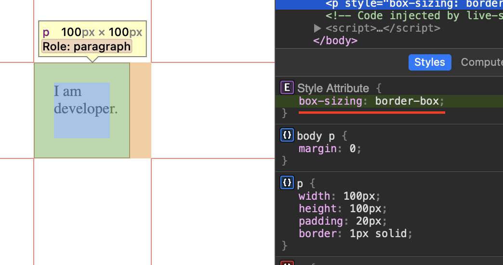
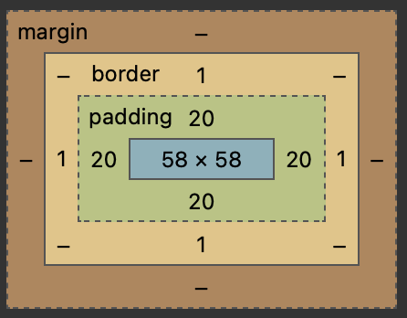

# Box Model

## Intro

Box Model là một kỹ thuật cơ bản nhất trong CSS Layout và được sử dụng để bạn mô tả về khoảng cách mà mỗi phần tử trên website được sở hữu, hay nói cách khác là kỹ thuật tinh chỉnh khoảng cách hiển thị cho mỗi phần tử trên website.

Kỹ thuật Box Model trong CSS bao gồm 4 phần quan trọng đó là:

- `Margin`: Khoảng cách tính từ bên ngoài của phần tử.
- `Border`: Đường viền của phần tử.
- `Padding`: Khoảng cách tính từ bên trong của phần tử.
- `Content`: Nội dung trong phần tử.


## Example

```html title="Example"
<p>I am developer.</p>
```

```css title="Example"
p {
  width: 100px;
  height: 100px;
  padding: 20px;
  border: 1px solid;
}
```

**Kết quả:**



Nội dung có chiều dài và rộng là `142px`, thay vì `100px` như đã chỉ định và nội dung này nằm ngoài phần tử của bạn. Tại sao vậy?

:::info[Thông tin]
CSS được hiển thị lên đều là hình hộp (`box`), dựa trên đó để tính toán kích thước.

Nội dung bên trong sẽ ảnh hưởng đến kích thước của hộp theo mặc định.
:::

Dưới đây là công thức tính tổng Width (Height) của một phần tử HTML:

Chiều rộng = `width` + `border left` + `border right` + `padding left` + `padding right`

Chiều cao = `height` + `border top` + `border bottom` + `padding top` + `padding bottom`



=> Kích thước phần tử được tính như sau:

- Chiều rộng: `100 (chiều rộng)` + `20 padding left` + `20 padding right` + `1 border left` + `1 border right` = `142px`
- Chiều cao: `100 (chiều cao)` + `20 padding top` + `20 padding bottom` + `1 border top` + `1 border bottom` = `142px`

## Box-sizing

`box-sizing: content-box|border-box|initial|inherit`

Cho phép chúng ta chọn lựa cách thức tính toán kích thước của phần tử, bao gồm cả `padding`, `border` trong tổng thể kích thước của phẩn tử.

### content-box ( Default )

```css title="Example"
p {
  box-sizing: content-box;
}
```

`content-box` là giá trị mặc định của `box-sizing`, cho phép kích thước gốc của phần tử được giữ nguyên, kích thước gốc sẽ được tăng lên nếu có thêm `padding` và `border`.




Kích thước gốc của phần tử vẫn giữ nguyên, bị `padding` và `border` làm tăng kích thước lên.

### border-box

```css title="Example"
p {
  box-sizing: border-box;
}
```

Cho phép tính toán lại kích thước gốc phần tử, sao cho kích thước gốc sẽ gồm có cả `padding` và `border`. Kích thước gốc sẽ bị giảm đi, để bù vào `padding` và `border`.




Kích thước gốc của phần từ đã bị giảm xuống để đảm bảo sao cho khi thành phần có `padding` và `border` cũng sẽ không bị vượt quá kích thước quy định.

:::tip[TIP]
Thông thường ta sẽ đặt `box-sizing: border-box;` ở vị trí cao nhất và áp dụng cho tất cả các phần từ khi css, để có thể kiểm soát được bố cục không bị vỡ trong quá trình phát triển.

```css
* {
  box-sizing: border-box;
}
```

:::
