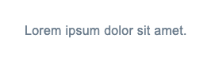

# Inheritance

Kế thừa các giá trị thuộc tính trong css.

## Inheritance flow

```html title="Example"
<html>
  <body>
    <article>
      <p>Lorem ipsum dolor sit amet.</p>
    </article>
  </body>
</html>
```

```css title="Example"
html {
  color: lightslategray;
}
```

Phần tử gốc (`<html>`) sẽ không kế thừa bất kỳ thứ gì vì đây là phần tử đầu tiên trong tài liệu. Thêm một số CSS vào phần tử HTML và nó bắt đầu xếp tầng xuống tài liệu.



Thuộc tính màu sắc được kế thừa theo mặc định bởi các phần tử khác. Phần tử html có màu: `Lightslategray`, do đó tất cả các phần tử có thể kế thừa màu bây giờ sẽ có màu `Lightslategray`.

## Which properties are inherited by default?

Các thuộc tính được kế thừa theo mặc định

- `azimuth`
- `border-collapse`
- `border-spacing`
- `caption-side`
- `color`
- `cursor`
- `direction`
- `empty-cells`
- `font-family`
- `font-size`
- `font-style`
- `font-variant`
- `font-weight`
- `font`
- `letter-spacing`
- `line-height`
- `list-style-image`
- `list-style-position`
- `list-style-type`
- `list-style`
- `orphans`
- `quotes`
- `text-align`
- `text-indent`
- `text-transform`
- `visibility`
- `white-space`
- `widows`
- `word-spacing`

:::warning[Lưu ý]
Không phải tất cả các thuộc tính CSS đều được kế thừa theo mặc định
:::

## How inheritance works

Mọi phần tử HTML đều có mọi thuộc tính CSS được xác định theo mặc định với giá trị ban đầu. Giá trị ban đầu là thuộc tính không được kế thừa và hiển thị dưới dạng mặc định nếu tầng không tính được giá trị cho phần tử đó.

Các thuộc tính có thể được kế thừa theo tầng xuống và các phần tử con sẽ nhận được giá trị được tính toán đại diện cho giá trị của phần tử cha. Trừ khi ở các phần từ con được định nghĩa lại giá trị thuộc tính, thì thuộc tính được kế thừa xuống sẽ bị ghi đè.

## How to explicitly inherit and control inheritance

### The inherit keyword

Giúp kế thừa lại thuộc tính css của phẩn tử cha, yêu cầu trình duyệt tìm kiếm giá trị của phần tử cha gần nó nhất, và sử dụng lại cái đó. Nếu như phần tử cha gần nhất của nó cũng có giá trị `inherit` thì nó sẽ tiếp tục tìm đi lên cho đến khi thấy giá trị nào đó.

```css title="Example"
p {
  color: inherit;
}
```

### The initial keyword

Giúp cho trình duyệt sử dụng giá trị thuộc tính gốc của nó.

```css title="Example"
.parent {
  font-weight: 500;
}
.children {
  font-weight: inherit; /* font-weight: 500 */
}
```

> Mỗi thuộc tính đều có style gốc của nó.

### The unset keyword

Là thuộc tính đặc biệt, nó sẽ có tác dụng khác nhau trong những trường hợp khác nhau.

Trong CSS, có hai loại thuộc tính:

- `Thuộc tính kế thừa (inherited properties)`: là những thuộc tính ảnh hưởng tới thuộc tính con của nó.
- `Thuộc tính không kế thừa (non-inherited properties)`: là tất cả những thuộc tính mà chỉ ảnh hưởng tới một phần tử mà nó định nghĩa.

:::info[Thông tin]

- `unset` sẽ hoạt động giống với `inherit` cho những `thuốc tính kế thừa.`
- `unset` sẽ hoạt động giống với `initial` cho những `thuốc tính không kế thừa.`

:::

```css title="Exmaple"
.some-class {
  color: unset; /* hoạt động như 'inherit' */
  display: unset; /* hoạt động như 'initial' */
}
```
