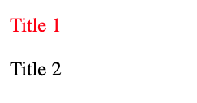
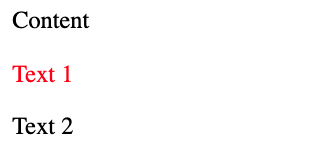
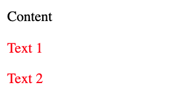

# Selectors

## The parts of a CSS rule


## Simple selectors

### Universal selector

```css title="Example"
* {
  color: hotpink;
}
```

Bộ chọn này sẽ áp dụng lên tất cả các phần tử `HTML` có trong trang.

### Type selector

```css title="Example"
section {
  padding: 2em;
}
```

Dùng `tên thẻ của HTML` để làm bộ chọn. Các phần tử khớp với bộ chọn sẽ được áp dụng css.

### Class selector

```html title="Example"
<div class="my-class"></div>
<button class="my-class"></button>
<p class="my-class"></p>
```

```css title="Example"
.my-class {
  color: red;
}
```

Một phần tử HTML có thể có một hoặc nhiều giá trị trong `class`. Bộ chọn `class` khớp với bất kỳ phần tử nào được chỉ định đúng giá trị của bộ chọn.

### ID selector

```html title="Example"
<div id="rad"></div>
```

```css title="Example"
#rad {
  border: 1px solid blue;
}
```

Phần tử HTML có thuộc tính `id`, và `id` phải là phần tử duy nhất trên trang. Sử dụng `#` để áp dụng bộ chọn

:::warning[Lưu ý]
`#`: áp dụng cho bộ chọn `ID`

`.`: áp dụng cho bộn chọn `class`
:::

### Attribute selector

```html title="Example"
<div data-type="primary"></div>
```

```css title="Example"
[data-type="primary"] {
  color: red;
}
/* Chọn các phẩn tử có data-type="primary" */
```

Sử dụng bộ chọn thuộc tính `[]`

Bạn cũng có thể chọn các thuộc tính mà không quan tâm đến giá trị.

```html title="Example"
<div data-type="primary"></div>
<div data-type="secondary"></div>
```

```css title="Example"
[data-type] {
  color: red;
}
/* Chọn các phẩn tử có data-type */
```

> Bạn có thể sử dụng bộ chọn thuộc tính phân biệt chữ hoa chữ thường bằng cách thêm toán tử `s` vào bộ chọn thuộc tính của mình.

```css title="Example"
[data-type="primary" s] {
  color: red;
}
```

1 số bộ chọn khác với thuộc tính.

```css title="Example"
/* bộ chọn thuộc tính "href" có chứa "example.com" */
[href*="example.com"] {
  color: red;
}

/* bộ chọn thuộc tính "href" bắt đầu với giá trị "https" */
[href^="https"] {
  color: green;
}

/* bộ chọn thuộc tính "href" kết thúc với giá trị ".com" */
[href$=".com"] {
  color: blue;
}
```

### Grouping selectors

```css title="Example"
strong,
em,
.my-class,
[lang] {
  color: red;
}
```

Bộ chọn không nhất thiết phải khớp với một phần tử duy nhất. Có thể nhóm nhiều bộ chọn bằng cách phân tách chúng bằng dấu phẩy.

## Pseudo-classes and pseudo-elements

Các loại bộ chọn tập trung vào trạng thái nền tảng cụ thể, như khi một phần tử được di chuột, các cấu trúc bên trong một phần tử hoặc các bộ phận của phần tử.

### Pseudo-classes

Các phần tử HTML xuất hiện ở nhiều trạng thái khác nhau, do chúng được tương tác hoặc một trong các phần tử con của chúng ở một trạng thái nhất định.
Sử dụng dấu 2 chấm đơn `:`.

```css title="Example"
/* Trạng thái hover vào phần tử a */
a:hover {
  outline: 1px dotted green;
}

/* Áp dụng các phần tử p ngang hàng với nhau và ở vị trí chẵn */
p:nth-child(even) {
  background: floralwhite;
}
```

### Pseudo-element

Là phần tử giả , được sử dụng để tạo một số style đặc biệt của element được chọn. Sử dụng dấu 2 chấm kép `::`.

:::tip[Lưu ý]
`Pseudo-classes` dùng dấu 2 chấm đơn `:`

`Pseudo-element` dùng dấu 2 chấm kép `::`
:::

```css title="Example"
/* Tạo ra phần tử giả đứng trước phần tử thật */
.my-element::before {
  content: "content";
}
```

## Complex selectors

### Combinators

- `>` bộ chọn phần tử con trực tiếp dựa trên phần tử cha

```css title="Example"
div > p {
  color: red;
}
```

```html title="Example"
<div>
  <p>Title 1</p>
  <span>
    <p>Title 2</p>
  </span>
</div>
<!-- Chỉ có thẻ p là "Title 1" mới được áp dụng style -->
```



#### Sibling CSS Selector

- `+` bộ chọn phần tử anh chị em liền kề ngang hàng với nó. Áp dụng cho phần tử anh chị em được đặt ngay sau phần tử đó.

```css title="Example"
div + p {
  color: red;
}
```

```html title="Example"
<div>
  <p>Content</p>
</div>
<p>Text 1</p>
<p>Text 2</p>
<!-- Chỉ có thẻ p là "Text 1" mới được áp dụng style -->
```



- `~` áp dụng cho toàn bộ phần tử anh chị em liền kề, ngang hàng với nó và không giới hạn 1 phần tử đầu tiên.

```css title="Example"
div ~ p {
  color: red;
}
```

```html title="Example"
<div>
  <p>Content</p>
</div>
<p>Text 1</p>
<p>Text 2</p>
<!-- Cả 2 thẻ p đều được áp dụng style -->
```



:::tip[Lưu ý]
`>` áp dụng cho phần tử con trực tiếp.

`+` áp dụng cho phần tử anh chị em liền kề đầu tiên.

`~` áp dụng tất cả các phần tử anh chị em liền kề.
:::
