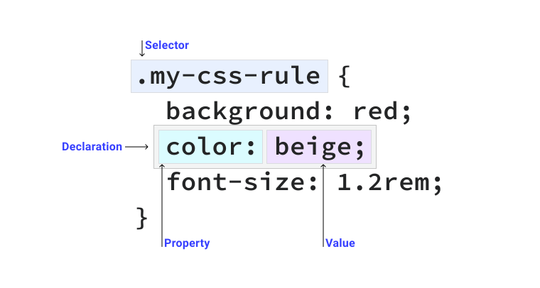

# Selectors

## The parts of a CSS rule



## Simple selectors

### Universal selector

```css title="Example"
* {
  color: hotpink;
}
```

Bộ chọn này sẽ áp dụng lên tất cả các phần từ `HTML` có trong trang.

### Type selector

```css title="Example"
section {
  padding: 2em;
}
```

Dùng `tên thẻ của HTML` để làm bộ chọn. Tất cả các phần tử khớp với bộ chọn sẽ được áp dụng css.

### Class selector

```html title="Example"
<div class="my-class"></div>
<button class="my-class"></button>
<p class="my-class"></p>
```

```css title="Example"
.my-class {
  color: red;
}
```

Một phần tử HTML có thể có một hoặc nhiều giá trị trong `class`. Bộ chọn `class` khớp với bất kỳ phần tử nào được chỉ định đúng giá trị của bộ chọn.

### ID selector

```html title="Example"
<div id="rad"></div>
```

```css title="Example"
#rad {
  border: 1px solid blue;
}
```

Phần tử HTML có thuộc tính `id`, và `id` phải là phần tử duy nhất trên trang. Sử dụng `#` để áp dụng bộ chọn

:::warning[Lưu ý]
`#`: áp dụng cho bộ chọn `ID`

`.`: áp dụng cho bộn chọn `class`
:::

### Attribute selector

```html title="Example"
<div data-type="primary"></div>
```

```css title="Example"
[data-type="primary"] {
  color: red;
}
/* Chọn tất cả các phẩn tử có data-type="primary" */
```

Sử dụng bộ chọn thuộc tính `[]`

Bạn cũng có thể chọn tất cả các thuộc tính mà không quan tâm đến giá trị.

```html title="Example"
<div data-type="primary"></div>
<div data-type="secondary"></div>
```

```css title="Example"
[data-type] {
  color: red;
}
/* Chọn tất cả các phẩn tử có data-type */
```

> Bạn có thể sử dụng bộ chọn thuộc tính phân biệt chữ hoa chữ thường bằng cách thêm toán tử `s` vào bộ chọn thuộc tính của mình.

```css
[data-type="primary" s] {
  color: red;
}
```
