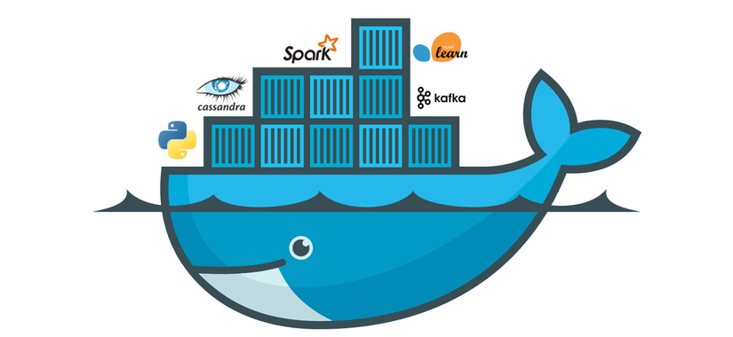

Docker là một nền tảng mã nguồn mở cho phép bạn tự động hóa việc triển khai, mở rộng và quản lý các ứng dụng trong môi trường container

Container là một đơn vị phần mềm nhẹ, độc lập, chứa tất cả các thành phần cần thiết để chạy một ứng dụng, bao gồm mã nguồn, thư viện, công cụ và các phụ thuộc.

Docker giúp đóng gói ứng dụng và các phụ thuộc của nó vào một container, đảm bảo rằng ứng dụng có thể chạy nhất quán trên bất kỳ môi trường nào.

#### Các thành phần chính của Docker:

1.  **Docker Engine**: Là phần lõi của Docker, chịu trách nhiệm tạo và quản lý các container.

2.  **Docker Image**: Là một template chỉ đọc chứa các hướng dẫn để tạo ra một container. Image có thể được tạo từ một file Dockerfile.

3.  **Docker Container**: Là một instance của Docker Image, chạy như một tiến trình độc lập trên hệ thống.

4.  **Dockerfile**: Là một file text chứa các lệnh để xây dựng một Docker Image.

5.  **Docker Hub**: Là một kho lưu trữ công cộng nơi bạn có thể tìm và chia sẻ các Docker Image.
