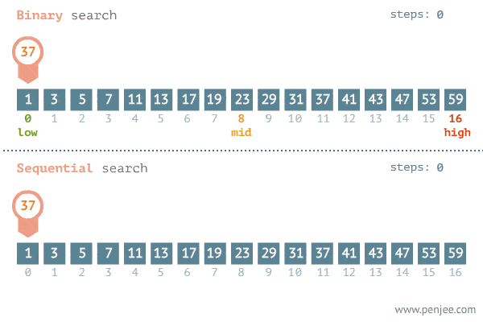

**Binary Search** (tìm kiếm nhị phân) là một thuật toán hiệu quả để tìm kiếm một phần tử trong danh sách đã được sắp xếp.

Thay vì duyệt qua từng phần tử một cách tuần tự, thuật toán này chia danh sách thành hai nửa, sau đó chỉ kiểm tra một nửa chứa giá trị cần tìm, tiếp tục chia đôi cho đến khi tìm thấy hoặc không tìm thấy giá trị.



## Nguyên tắc hoạt động:

1.  **Bước chuẩn bị**: Danh sách phải được sắp xếp (tăng dần hoặc giảm dần).
2.  **Bước thực hiện**:
    - Xác định chỉ số giữa của danh sách.
    - So sánh giá trị ở giữa với giá trị cần tìm.
      - Nếu giá trị ở giữa **bằng** giá trị cần tìm, trả về chỉ số của phần tử đó.
      - Nếu giá trị ở giữa **lớn hơn** giá trị cần tìm, tiếp tục tìm trong nửa **trái**.
      - Nếu giá trị ở giữa **nhỏ hơn** giá trị cần tìm, tiếp tục tìm trong nửa **phải**.
3.  **Lặp lại**: Tiếp tục chia nhỏ nửa tương ứng cho đến khi tìm thấy giá trị hoặc danh sách không còn phần tử nào.

## Ví dụ

```js
const binarySearch = (nums, target) => {
  let left = 0;
  let right = nums.length - 1;

  while (left <= right) {
    const mid = Math.floor((left + right) / 2);

    if (nums[mid] === target) {
      return mid;
    } else if (nums[mid] > target) {
      right = mid - 1;
    } else {
      left = mid + 1;
    }
  }

  return left;
};

console.log(binarySearch([1, 2, 3, 6, 8], 3)); // 2
console.log(binarySearch([1, 2, 3, 6, 8], 0)); // 0
console.log(binarySearch([1, 2, 3, 6, 8], 7)); // 4
console.log(binarySearch([1, 2, 3, 6, 8], 10)); // 5
```

### 1) Tại sao điều kiện lại vòng lặp white là `left <= right`?

**Giải thích**:

- Điều kiện `left <= right` được sử dụng để đảm bảo rằng chúng ta vẫn còn một khoảng tìm kiếm hợp lệ. Khi `left > right`, tức là khoảng tìm kiếm đã bị thu hẹp và không còn phần tử nào để kiểm tra.
- Mỗi lần lặp, chúng ta chia khoảng tìm kiếm thành hai phần và loại bỏ một nửa (nửa trái hoặc nửa phải). Điều kiện `left <= right` đảm bảo chúng ta tiếp tục kiểm tra cho đến khi khoảng này trở thành rỗng (khi `left > right`).

#### Ví dụ:

- Mảng: `[1, 3, 5, 6]`, `target = 2`.
- Ban đầu: `left = 0`, `right = 3`.
  - Lần 1: `mid = 1`, `nums[mid] = 3`, do `3 > 2`, nên `right = mid - 1 = 0`.
  - Lần 2: `mid = 0`, `nums[mid] = 1`, do `1 < 2`, nên `left = mid + 1 = 1`.
- Lúc này, `left = 1`, `right = 0` → điều kiện `left > right` kết thúc vòng lặp.

Khi thoát vòng lặp, chỉ số `left` là nơi chèn thích hợp.

### 2) Tại sao giá trị trả về là `left` mà không phải `right`?

**Giải thích**:

- Khi vòng lặp kết thúc, giá trị `left` đại diện cho **chỉ số đầu tiên lớn hơn hoặc bằng** `target` trong mảng:
  - Nếu `target` đã tồn tại trong mảng, `left` sẽ trỏ đến đúng vị trí của nó.
  - Nếu `target` không tồn tại, `left` sẽ chỉ ra vị trí mà nó cần được chèn vào để giữ cho mảng được sắp xếp.
- Ngược lại, `right` chỉ là chỉ số cuối cùng đã kiểm tra, và sau vòng lặp, nó không còn đảm bảo là vị trí hợp lệ để chèn.

#### Ví dụ:

**Mảng**: `[1, 3, 5, 6]`, **Target**: `2`.

1.  **Ban đầu**: `left = 0`, `right = 3`.
2.  **Lần 1**:
    - `mid = 1` → `nums[mid] = 3 > 2` → `right = mid - 1 = 0`.
3.  **Lần 2**:
    - `mid = 0` → `nums[mid] = 1 < 2` → `left = mid + 1 = 1`.
4.  **Kết thúc vòng lặp**: `left = 1`, `right = 0`.

Tại thời điểm này:

- `left` chỉ ra vị trí chèn `target = 2`, vì nó là chỉ số đầu tiên lớn hơn hoặc bằng `2`.
- `right` chỉ trỏ về một vị trí cũ đã loại bỏ (không hợp lệ để chèn).

## Lưu ý:

- **Điều kiện tiên quyết**: Danh sách phải được sắp xếp. Nếu không, bạn cần sắp xếp trước bằng cách sử dụng `arr.sort()`.
- Binary Search chỉ hiệu quả với các tập dữ liệu lớn và danh sách đã sắp xếp.
