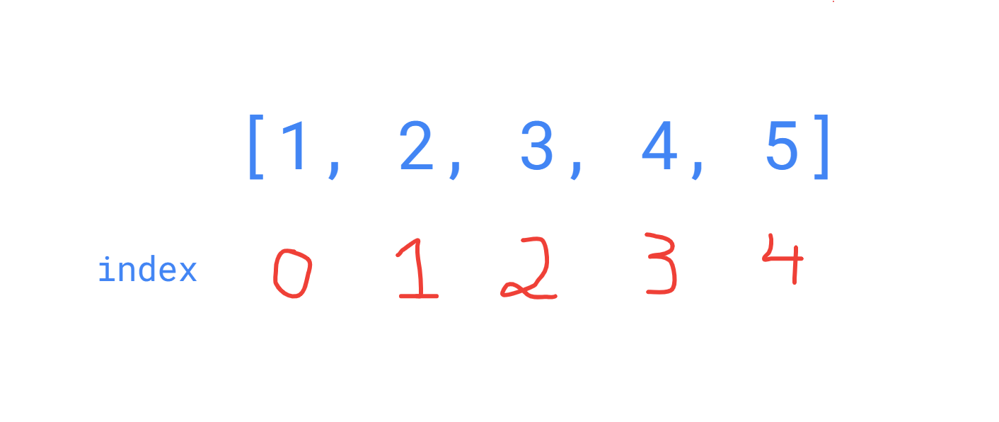

# Array

Là loại cấu trúc dữ liệu lưu trữ nhiều thành phần dữ liệu lại với nhau.

Mảng được sử dụng nhiều trong thuật toán.

```js title='JS'
const data = [1, 2, 3, "hello", { name: "product" }];
```

Mỗi phần tử trong mảng đều được đặt 1 chỉ mục, chỉ mục sẽ bắt đầu từ `0`.



```js
const data = [1, 2, 3, "hello", { name: "product" }];

console.log(data[1]); // 2
```

> Ta có thể dễ dàng lấy được giá trị của phần tử thông qua chỉ mục
