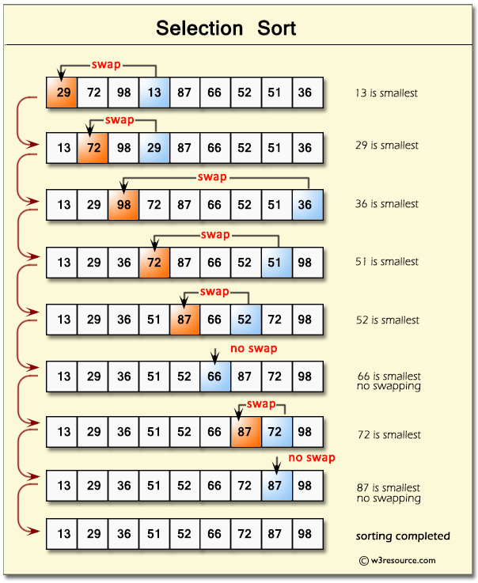

# Selection sort

`Sắp xếp lựa chọn` là một thuật toán sắp xếp đơn giản nhưng không hiệu quả đối với các danh sách lớn.

Thuật toán này hoạt động bằng cách tìm phần tử nhỏ nhất (hoặc lớn nhất, tùy thuộc vào cách sắp xếp) trong danh sách chưa được sắp xếp, sau đó đổi chỗ nó với phần tử đầu tiên trong danh sách. Quá trình này tiếp tục cho đến khi toàn bộ danh sách được sắp xếp.



**Ý tưởng**

- Đi tìm chỉ số `index` của giá trị nhỏ nhất trong mảng.
- Sau đó hoán đổi vị trí của phần tử có `index` lên đầu mảng.
- Sẽ tiếp tục quá trình đó và bỏ qua các vị trí đầu mảng đã được sắp xếp.

> Trong vòng lặp đầu tiên sẽ luôn sắp xếp được đúng 1 vị trí lên đầu mảng.

## Example explanation

```js
const numbers = [6, 1, 2, 5, 7, 4, 3];

const n = numbers.length;

for (let i = 0; i < n - 1; i++) {
  let minIndex = i;
  for (let j = i + 1; j < n; j++) {
    if (numbers[j] < numbers[minIndex]) {
      minIndex = j;
    }
  }

  if (minIndex !== i) {
    let temp = numbers[i];
    numbers[i] = numbers[minIndex];
    numbers[minIndex] = temp;
  }
}

console.log(numbers);
```

Giả sử bạn có một mảng cần sắp xếp theo thứ tự tăng dần: `[64, 25, 12, 22, 11]`.

`Bước 1`: Tìm phần tử nhỏ nhất trong mảng [64, 25, 12, 22, 11].

- Phần tử nhỏ nhất là 11, vì vậy chúng ta hoán đổi 64 và 11.
- Mảng sau khi hoán đổi: [11, 25, 12, 22, 64].

`Bước 2`: Tìm phần tử nhỏ nhất trong mảng con [25, 12, 22, 64].

- Phần tử nhỏ nhất là 12, và chúng ta hoán đổi 25 với 12.
- Mảng sau khi hoán đổi: [11, 12, 25, 22, 64].

`Bước 3`: Tìm phần tử nhỏ nhất trong mảng con [25, 22, 64].

- Phần tử nhỏ nhất là 22, và chúng ta hoán đổi 25 với 22.
- Mảng sau khi hoán đổi: [11, 12, 22, 25, 64].

`Bước 4`: Tìm phần tử nhỏ nhất trong mảng con [25, 64].

- Phần tử nhỏ nhất là 25, nhưng nó đã ở đúng vị trí rồi, nên không cần hoán đổi.
- Mảng không thay đổi: [11, 12, 22, 25, 64].

`Bước 5`: Chỉ còn một phần tử 64, mảng đã hoàn tất việc sắp xếp.
