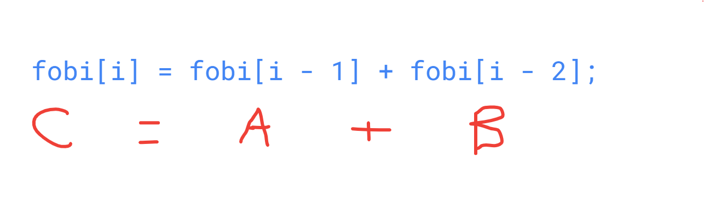

# Data Structures and Algorithms

Là phần cơ bản của Khoa học Máy tính dạy bạn cách suy nghĩ và giải quyết các vấn đề phức tạp một cách có hệ thống.

Việc sử dụng cấu trúc dữ liệu và thuật toán phù hợp giúp chương trình của bạn chạy nhanh hơn, đặc biệt khi làm việc với nhiều dữ liệu.

## Data structures

Là một cách tổ chức và lưu trữ dữ liệu trong máy tính sao cho dữ liệu có thể được sử dụng một cách hiệu quả.

Nói cách khác, nó giống như một cái tủ để bạn sắp xếp đồ đạc của mình, nhưng thay vì quần áo, sách vở, tủ này chứa các dữ liệu mà chương trình của bạn cần sử dụng.

**Các loại cấu trúc dữ liệu phổ biến**

- `Mảng (Array)`: Một tập hợp các phần tử có cùng kiểu dữ liệu, được sắp xếp theo một thứ tự nhất định.
- `Danh sách liên kết (Linked list)`: Một dãy các phần tử, mỗi phần tử chứa dữ liệu và một liên kết đến phần tử tiếp theo.
- `Stack (Ngăn xếp)`: Một cấu trúc dữ liệu LIFO (Last In First Out), nghĩa là phần tử cuối cùng được thêm vào sẽ là phần tử đầu tiên được lấy ra.
- `Queue (Hàng đợi)`: Một cấu trúc dữ liệu FIFO (First In First Out), nghĩa là phần tử đầu tiên được thêm vào sẽ là phần tử đầu tiên được lấy ra.
- `Cây (Tree)`: Một cấu trúc dữ liệu phi tuyến tính, trong đó các phần tử được tổ chức theo một cấu trúc cấp bậc.
- `Đồ thị (Graph)`: Một cấu trúc dữ liệu phi tuyến tính, mô tả mối quan hệ giữa các đối tượng.
- Và nhiều loại khác: `Hash table`, `heap`, `trie`,...

## Algorithms

Thuật toán là một tập hợp các hướng dẫn cụ thể, xác định một chuỗi các bước để giải quyết một vấn đề.

Nói cách khác, nó giống như một công thức nấu ăn, chỉ cho bạn từng bước để tạo ra một món ăn.

**Các tiêu chí đánh giá thuật toán**

- `Time complexity` (Độ phức tạp thời gian): Thời gian thực thi của thuật toán khi kích thước dữ liệu tăng lên.
- `Space complexity` (Độ phức tạp không gian): Lượng bộ nhớ mà thuật toán sử dụng.

**Mối quan hệ giữa cấu trúc dữ liệu và thuật toán**

- Cấu trúc dữ liệu cung cấp một cách để tổ chức dữ liệu, trong khi thuật toán sử dụng cấu trúc dữ liệu đó để thực hiện các thao tác trên dữ liệu.
- Việc chọn cấu trúc dữ liệu phù hợp sẽ ảnh hưởng trực tiếp đến hiệu quả của thuật toán.
- Một thuật toán tốt thường kết hợp với một cấu trúc dữ liệu phù hợp để giải quyết vấn đề một cách hiệu quả nhất.

## Example

`Fibonacci`

Là 1 dãy số mà trong đó:

- Hai số `Fibonacci` đầu tiên là `0` và `1`, số Fibonacci tiếp theo luôn là tổng của hai số trước đó nên ta được `0, 1, 1, 2, 3, 5, 8, 13, 21`,

**1. Sử dụng cách thông thường**

```js
const fibo = [0, 1];
for (let i = 2; i < 10; i++) {
  fobi[i] = fobi[i - 1] + fobi[i - 2];
}
console.log(fobi); // [0, 1, 1, 2, 3, 5, 8, 13, 21, 34]
```

**Ý tưởng**

- Dãy số `Fibonacci` sẽ bắt đầu từ `0, 1`, sử dụng luôn 2 giá trị đó làm 2 phần tử đầu của mảng `[0, 1]`
- Thực hiện lặp từ vị trí tiếp theo của dãy số `Fibonacci`, ta đã có 2 giá trị ban đầu là `0, 1` nên vị trí lặp tiếp theo sẽ bắt đầu từ vị trí thứ `3` trong dãy số.
  - Nhưng `index` của mảng bắt đầu từ `0`, nên chỉ số `index` lặp tiếp theo sẽ bắt đầu từ `i = 2`

```js
for (let i = 2; i < 10; i++)
```

- `Số Fibonacci tiếp theo luôn là tổng của hai số trước đó`:
  - Mà ta đã có 2 giá trị đầu tiên là `0, 1`, giá trị tiếp theo sẽ là `0 + 1 = 1`, dãy số là `0, 1, 1, ...`
- Suy ra `A + B = C <=> C = (C - A) + (C - B)`
  - `A`: giá trị phần tử đứng thứ `nhất` trong dãy số, `=> fobi[i - 1]`
  - `B`: giá trị phần tử đứng thứ `hai` trong dãy số, `=> fobi[i - 2]`
  - `C`: giá trị phần tử tiếp theo trong dãy số `Fibonacci` cần tìm, `=> fibo[i]`

```js
fobi[i] = fobi[i - 1] + fobi[i - 2];
```



**2. Sử dụng đệ quy (`Recursion`)**

```js
function fibonacci(n) {
  // Điều kiện dừng: Fibonacci(0) = 0, Fibonacci(1) = 1
  if (n === 0) {
    return 0;
  }
  if (n === 1) {
    return 1;
  }

  // Câu lệnh đệ quy: Fibonacci(n) = Fibonacci(n-1) + Fibonacci(n-2)
  return fibonacci(n - 1) + fibonacci(n - 2);
}

console.log(fibonacci(5)); // Output: 5
```
