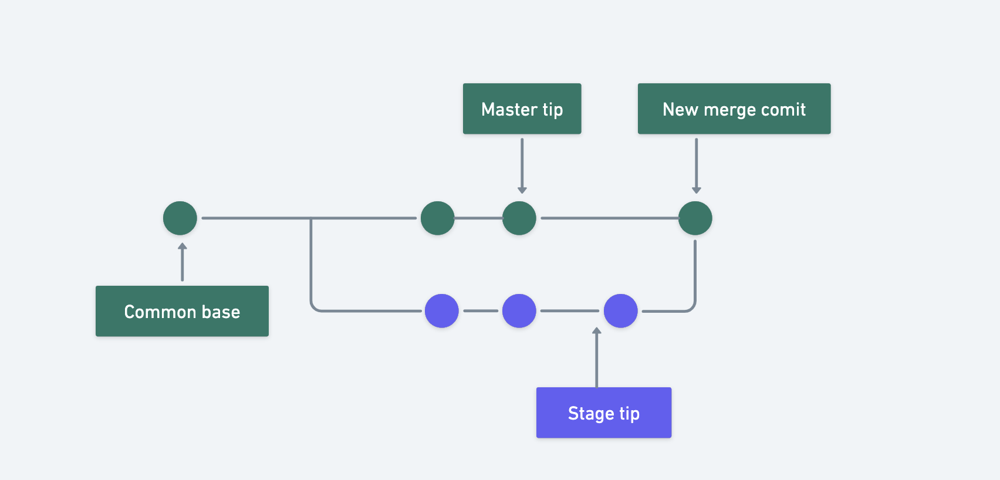
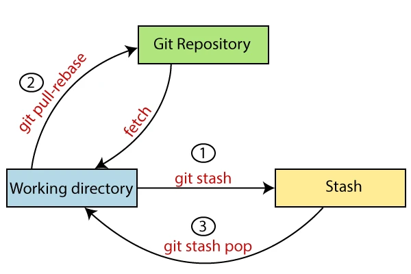

# Advanced command

## Git reset

Dùng để hoàn tác, hủy `commit` hoặc hủy đưa thay đổi từ `Staging area` sang `Working directory`

```bash
git reset
```

### Git reset HEAD~n

Hoàn tác quay trở lại với số lượng `commit` mà bạn muốn chỉ định.

```bash
git reset HEAD~n
```

- `n` số lượng `commit` là bạn muốn hoàn tác quay trở lại trước đó.

```bash title="Example"
git reset HEAD~2
# Hoàn tác trở lại 2 commit mới nhất
```

### --hard

`--hard` có nghĩa là bỏ commit đi và bỏ cả những thay đổi chưa được commit trong working space. Khi này môi trường sẽ hoàn toàn “sạch sẽ” như thời điểm trước khi commit.

```bash
git reset --hard HEAD^n
```

### --soft

`--soft` có nghĩa là bỏ commit đi nhưng giữ nguyên những thay đổi chưa được commit trong working space. `--soft` hữu dụng khi bạn muốn giữ lại những thay đổi chưa commit cho lần commit tiếp theo.

Trạng thái các file sẽ ở `Staging area` sau khi thực hiện `reset`

```bash
git reset --soft HEAD^n
```

## Git merge

Gộp nhánh, hợp nhất nhánh này vào nhánh khác.

Sau khi thực hiện `merge` sẽ tạo ra 1 `merge commit`, nếu có sung đột code giữa 2 nhánh (`conflict`), cần phải xử lý xong sau đó mới được `merge`.

Chỉ có nhánh hiện tại được cập nhật để phản ánh sự hợp nhất, còn nhánh đích sẽ không bị ảnh hưởng.

```bash
git merge <branch_name>

# merge tên nhánh được chỉ định <branch_name> vào nhánh hiện tại đang đứng
```

Hoặc

```bash
git merge <branch_a> <branch_b>

# merge <branch_b> vào <branch_a>
```



### Git merge --continue

Tiếp tục quá trình thực hiện `merge` code, sau khi đã giải quyết các `conflict` trong quá trình `merge`.

```bash
git merge --continue
```

## Git cherry pick

## Git revert

## Git stash

Lưu lại các thay đổi vào 1 vùng chứa (`repo`) và sau đó có thể lấy lại các thay đổi đó khi cần và tiếp tục triển khai tiếp.

Thực ra `Git` sẽ tạo ra một `commit` khi bạn sử `stash` và nó được lưu trữ lại trong repo của bạn.

> Chỉ `stash` được những file đang được theo dõi, các file tạo mới sẽ không `stash` được.

```bash
git stash
```



### Git stash -u

Lưu lại các thay đổi bao gồm cả `file tạo mới`.

```bash
git stash -u
```

### Git stash save

Thêm nội dung cho các lưu trữ ( tìm kiếm và muốn lấy lại sẽ dễ dàng hơn )

```bash
git stash save "message"
```

### Git stash list

Hiển thị danh sách các `stash` trong repo của bạn.

```bash
git stash list
```

### Git stash apply

### Git stash pop

### Git stash show

### Git stash clear

Xoá toàn bộ stash bạn đang lưu trữ trong repo, nó có thể sẽ không revert lại được.

```bash
git stash clear
```

### Git stash drop

## Git rebase

## Git reflog
