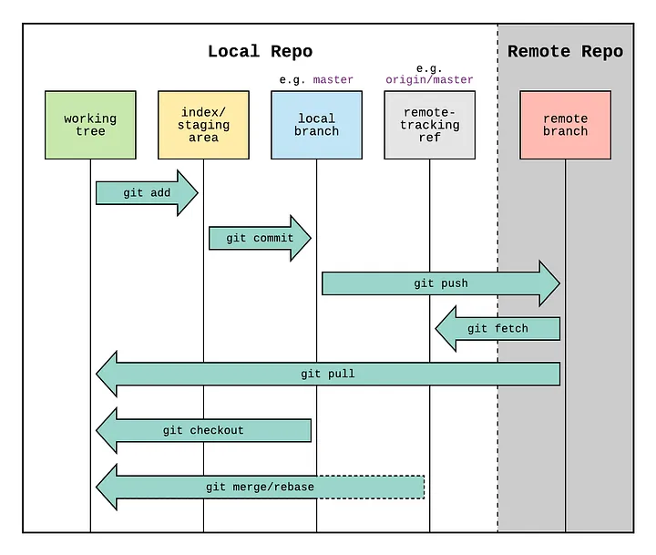

# Workflow

Quy trình làm việc dự án đơn giản và các lệnh `CLI`. Dưới đây là sơ đồ quy trình làm việc bao gồm `Git` & `Github`.



Phân chia ra các giai đoạn chính:

1. `local`: Code được lưu trữ ở `máy tính cá nhân`.

2. `remote`: Code được lưu trữ ở 1 web dịch vụ ngoài (`Github, Gitlab ...`).

## Local

\*) Khởi tạo 1 dự án dùng `git` để lưu trữ code, bắt đầu với

```bash
git init
```

Sẽ tạo ra 1 folder `.git` (folder ẩn) , nơi sẽ ghi lại các `lịch sử` thay đổi của dự án khi chúng ta `commit`.


### Working directory

`Working Directory` là thư mục chứa các tệp nguồn của dự án mà bạn đang làm việc. Đây là nơi `Git` sẽ kiểm tra và theo dõi những thay đổi (modifications) trên các tệp của dự án so với phiên bản trước được quản lý bởi `Git`.

Khi có sự thay đổi nó sẽ được đánh dấu lại, kiểm tra những file có sự thay đổi dùng `git status`


> Thường sẽ dùng màu `đỏ` ( màu mặc định ) để nhận biết được những file có sự thay đổi đang được theo dõi chưa vào `staging area`

**Lưu ý**

Cách hoạt động của Working Directory trong quy trình Git Workflow:

- `Untracked files`: Những tệp trong Working Directory chưa được Git quản lý. Nếu bạn thêm tệp mới vào dự án, Git sẽ không tự động theo dõi chúng trừ khi bạn thực hiện lệnh git add.

- `Modified files`: Nếu bạn chỉnh sửa một tệp đã được Git theo dõi, tệp này sẽ được đánh dấu là `"modified"` trong Working Directory.
  Staged files: Khi bạn thực hiện git add một tệp đã thay đổi, Git sẽ chuyển tệp đó từ Working Directory sang Staging Area, nơi nó sẵn sàng để được commit.

- `Staged files`: Khi bạn thực hiện git add một tệp đã thay đổi, Git sẽ chuyển tệp đó từ Working Directory sang Staging Area, nơi nó sẵn sàng để được commit.

### Staging area

Staging Area (hay còn gọi là Index) trong Git là một khu vực tạm trung gian giữa `Working Directory` và `Git Repository`. Trạng thái `sẵn sàng` để thực hiện `git commit` đưa lên `Git Repository`.

Nó cho phép bạn kiểm soát những thay đổi nào sẽ được `commit` vào `Git Repository`.

Là nơi bạn "đóng gói" các thay đổi trước khi chính thức lưu chúng vào lịch sử của dự án thông qua `commit`.


> Màu xanh sẽ biểu thị `Staging area`

Trong quy trình làm việc của Git, có 3 khu vực chính:

- `Working Directory`: Nơi bạn thực hiện các thay đổi trực tiếp trong dự án.
- `Staging Area`: Khu vực tạm thời, nơi lưu trữ các thay đổi đã được đánh dấu (staged) nhưng chưa commit.
- `Git Repository`: Lịch sử của dự án, nơi lưu trữ tất cả các commit.

#### Git add

Dùng `git add` để đưa từ `Working Directory` lên `Staging Area`.

```bash
git add .
```

> Dấu `.` sau `git add` để ám chỉ rằng sẽ đưa tất cả các file được theo dõi từ `Working Directory` lên `Staging Area`.

:::tip[TIP]
Nhận biết trạng thái qua màu

`Working Directory: màu đỏ`

`Staging Area: màu xanh`
:::

#### Git commit

Dùng `git commit` để đưa từ `Staging area` vào trong `Git Repository` để lưu trữ.

```bash
git commit -m "message"
```

### Git Repository

Sau khi thực hiện `git commit`, tất cả các file ở trạng thái `Staging Area` đã được lưu lại vào git ở local

Dùng `git log` để mở lịch sử các `commit` đã được lưu trữ

```bash
git log
```


## Remote

Sau khi đã thực hiện các `commit` lưu ở local, chúng ta muốn đưa lên `remote` để có thể nhiều nơi truy cập và xem được. Đó chính là lúc chúng ta sẽ dùng `Github`, `Gitlab` hoặc các dụng vụ lưu trữ remote khác.

```bash
git remote add origin 'url'
```

> Trong đó 'url' là địa chỉ kho chứa mà local sẽ liên kết đến remote, để sau này có thể đồng bộ, đưa code tử local lên remote hoặc ngược lại.

## Practice in project

Flow cơ bản làm việc với git trong dự án

1. Clone project từ server về Local Repository
2. Setup `git config` ( nếu cần )
3. Clone project về xong, thường sẽ đứng ở luôn nhánh chính (`main`, `master` ..., `đây sẽ là nhánh mà code được hoàn chỉnh và build lên product`)
4. Khi bắt đầu làm, cần chuyển sang nhánh khác, checkout từ nhánh `main`, vd: `feat/abc, fix/abc`
5. Xây dựng phát triển logic, fixbug ở trên nhánh ta vừa tạo và checkout sang và `commit`
6. Khi muốn đưa nội dung code sửa ở `local` lên `remote` để `review` và `merge`, cần phải `pull origin` nhánh `main` về để cập nhập lại code.
   > Vì làm việc teamwork có nhiều người code chung, không thể nào đảm bảo code ở máy local lúc nào cũng là code mới nhất, nên cần phải pull code mới từ nhánh main về, phòng trừ trường hợp bị `conflic code` thì sẽ cập nhập và sửa luôn.
7. Đưa code lên `remote` và tạo `pull request`
