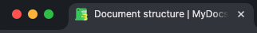

# Document structure

Cầu trúc cơ bản của 1 file html.

```html
<!DOCTYPE html>
<html lang="en">
  <head>
    <meta charset="UTF-8" />
    <meta name="viewport" content="width=device-width, initial-scale=1.0" />
    <title>Document</title>
  </head>
  <body></body>
</html>
```

## `<!DOCTYPE html>`

Nhìn có thể trông giống như một phần tử HTML nhưng thực tế không phải vậy. Là một loại nút đặc biệt gọi là "doctype". Loại tài liệu yêu cầu trình duyệt sử dụng chế độ tiêu chuẩn. Nếu bị bỏ qua, trình duyệt sẽ sử dụng chế độ hiển thị khác được gọi là chế độ quirks. Việc bao gồm loại tài liệu sẽ giúp ngăn chặn chế độ kỳ quặc.

## `<html>`

Phần tử `<html>` là phần tử gốc của tài liệu HTML. Nó là cha của `<head>` và `<body>`, chứa mọi thứ trong tài liệu HTML ngoại trừ `<!DOCTYPE html>`. Nếu bị bỏ qua, nó sẽ được ngụ ý, nhưng điều quan trọng là phải bao gồm nó, vì đây là thành phần mà ngôn ngữ nội dung của tài liệu được khai báo.

Thuộc tính **lang**

> Thuộc tính ngôn ngữ lang được thêm vào thẻ `<html>` xác định ngôn ngữ chính của tài liệu. Giá trị của thuộc tính lang là mã ngôn ngữ ISO gồm hai hoặc ba chữ cái theo sau là vùng. Khu vực này là tùy chọn nhưng được khuyến nghị vì ngôn ngữ có thể khác nhau rất nhiều giữa các khu vực.

## `<head>`

Thẻ `<head>` được lồng bên trong thẻ `<html>` cùng với thẻ `<body>`

```html
<!DOCTYPE html>
<html lang="en-US">
  <head></head>
  <!-- thẻ <head> -->
  <body></body>
</html>
```

Thẻ `<head>` chứa các dữ liệu, thông tin cho website.
Các thành phần `document title, character set, viewport settings, description, base URL, stylesheet links, and icons` nên được bao gồm trong thẻ `<head>`.
Có thể không cần tất cả những thành phần trên nhưng hãy luôn đảm bảo có `character set, title, and viewport settings.`

## Character encoding

```html
<head>
  <!-- Khai báo đầu tiên trong thẻ head -->
  <meta charset="utf-8" />
</head>
```

Là thành phần khai báo mã hóa ký tự bộ ký tự. Nó nên được xuất hiện trước tiêu đề, thành phần đầu tiên được khai báo trong thẻ `<head>` để đảm bảo trình duyệt có thể hiển thị các ký tự trong tiêu đề đó và tất cả các ký tự trong phần còn lại của tài liệu.

> UTF-8 (không phân biệt chữ hoa chữ thường)

Mã hóa ký tự được kế thừa vào mọi thứ trong tài liệu, thậm chí cả `<style>` và `<script>`. Nếu sử dụng biểu tượng cảm xúc, hãy đảm bảo sử dụng chúng theo cách nâng cao khả năng sử dụng mà không gây ảnh hưởng đến khả năng truy cập.

## Document title

```html
<title>Title website</title>
```

Thẻ `<title>` đại diện cho tên, tiêu đề của 1 trang duy nhất. Nội dung của tiêu đề là văn bản và được hiển thị trong tab của trình duyệt, danh sách các cửa sổ đang mở, lịch sử, kết quả tìm kiếm...



## Viewport metadata

Giúp hỗ trợ khả năng phản hồi của trang web, cho phép nội dung hiển thị tốt theo mặc định, bất kể chiều rộng khung nhìn.

```html
<meta
  name="viewport"
  content="width=device-width, initial-scale=1.0, user-scalable=1"
/>
```

- `width=device-width`: đặt chiều rộng của trang theo chiều rộng màn hình của thiết bị (sẽ thay đổi tùy theo thiết bị).
- `initial-scale=1.0`: đặt mức thu phóng ban đầu khi trang được trình duyệt tải lần đầu tiên.
- `user-scalable=1`: kiểm soát xem các hành động phóng to và thu nhỏ có được phép trên trang hay không.

## CSS

Có 3 cách để áp dụng css vào website:

- `<link>`
- `<style>`
- thuộc tính style

<!-- TODO: update later -->

## Scripts
