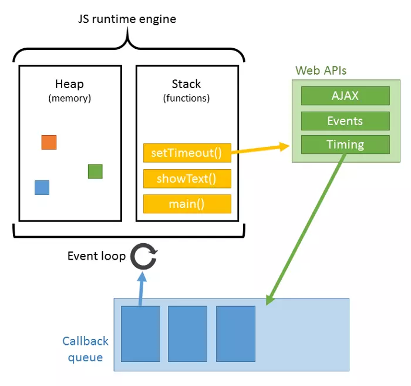
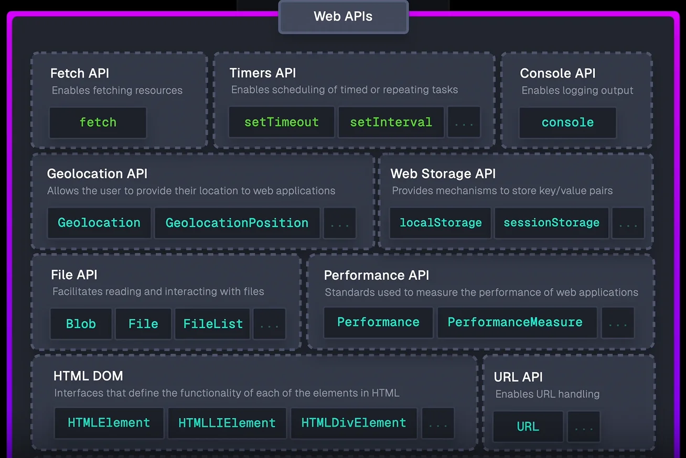

# Event loop

Event Loop là một cơ chế cho phép xử lý các tác vụ bất đồng bộ trong JavaScript, sử dụng một vòng lặp vô tận để kiểm tra, quản lý các tác vụ.

JavaScript có thể xử lý nhiều tác vụ cùng lúc mặc dù JavaScript là `single-threaded` - tại một thời điểm chỉ thực hiện một tác vụ duy nhất.

:::info[Thông tin]
Js là ngôn ngữ chạy đơn luồng.
:::

## How do Event loops work?

### Call Stack

- Quản lý thực thi các tác vụ của chương trình
- Khi một hàm được gọi trong JavaScript, hàm đó sẽ được thêm vào call stack.
- Call stack hoạt động theo cơ chế `FILO` (`First In Last Out`, vào trước ra sau).
- Khi hàm được thực hiện sẽ được đẩy ra khỏi call stack.

> JavaScript chỉ có thể xử lý một tác vụ tại một thời điểm. Điều này có nghĩa là các tác vụ chạy lâu hơn có thể sẽ chặn bất kỳ tác vụ khác thực thi phía sau, dễ hiểu hơn là đóng băng chương trình!

### Web APIs

### Task Queue

### Event Loop

### Microtask Queue
