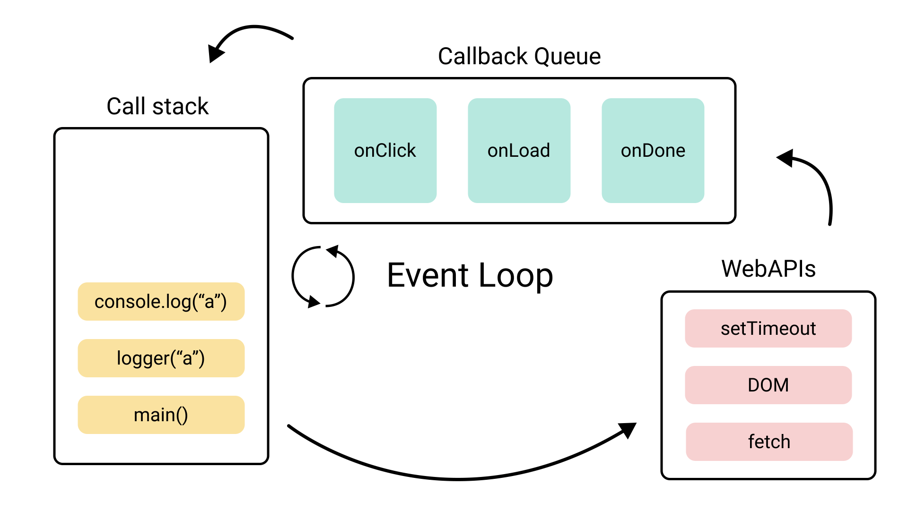

# Event loop

Event Loop là một cơ chế cho phép xử lý các tác vụ bất đồng bộ trong JavaScript, sử dụng một vòng lặp vô tận để kiểm tra, quản lý các tác vụ.

Kết hợp với Call Stack và các hàng đợi khác như Callback Queue và Microtask Queue. Các thành phần này giúp đảm bảo rằng JavaScript có thể xử lý các tác vụ bất đồng bộ mà không gây "đóng băng" ứng dụng.

:::info[Thông tin]
JavaScript là `single-threaded` - tại một thời điểm chỉ thực hiện một tác vụ duy nhất.
:::

## Ingredients



### Call Stack (Ngăn xếp gọi hàm)

- Quản lý thực thi các tác vụ của chương trình
- Khi một hàm được gọi trong JavaScript, hàm đó sẽ được thêm vào call stack.
- Call stack hoạt động theo cơ chế `FILO` (`First In Last Out`, vào trước ra sau).
- Khi hàm được thực hiện sẽ được đẩy ra khỏi call stack.

> JavaScript chỉ có thể xử lý một tác vụ tại một thời điểm. Điều này có nghĩa là các tác vụ chạy lâu hơn có thể sẽ chặn bất kỳ tác vụ khác thực thi phía sau, dễ hiểu hơn là đóng băng chương trình!

```js
function sayHello() {
  console.log("Hello");
}

sayHello();
```

- Khi `sayHello()` được gọi, nó sẽ được đưa vào Call Stack.
- Khi hàm này thực thi xong và in ra Hello, nó sẽ bị loại bỏ khỏi Call Stack.

### Web APIs (API của môi trường thực thi)


`Web APIs`:

Các API này được cung cấp bởi môi trường thực thi JavaScript (như trình duyệt hoặc Node.js). Chúng bao gồm các tính năng như setTimeout, fetch, hoặc các sự kiện như click, và chúng cho phép thực thi các tác vụ bất đồng bộ. Khi một tác vụ bất đồng bộ (ví dụ, setTimeout) được gọi, nó sẽ không chạy ngay lập tức, mà sẽ được gửi tới Web APIs để xử lý.

- `setTimeout`: Hẹn giờ để chạy một hàm sau một khoảng thời gian.
- `fetch`: Thực hiện các yêu cầu HTTP bất đồng bộ.
- `addEventListener`: Đăng ký các sự kiện như click, load, v.v.

### Callback Queue (Task Queue)

Callback Queue là nơi các callback của các tác vụ bất đồng bộ được đưa vào sau khi chúng hoàn thành.

> Ví dụ, khi setTimeout hoàn thành (sau khi thời gian chờ đã hết), callback của setTimeout sẽ được đưa vào Callback Queue, chờ để được thực thi khi Call Stack trống.

### Event Loop

Đây là cơ chế theo dõi Call Stack và Callback Queue. Event Loop sẽ kiểm tra Call Stack, và nếu Call Stack rỗng (không có hàm nào đang thực thi), nó sẽ di chuyển các callback từ Callback Queue vào Call Stack để thực thi.

### Microtask Queue

Là một loại hàng đợi khác, nhưng với độ ưu tiên cao hơn so với `Callback Queue`. Các `microtask` chủ yếu là callback của các tác vụ như `Promises`.

Khi một Promise được giải quyết (`fulfilled`) hoặc bị từ chối (`rejected`), callback của Promise sẽ được đưa vào `Microtask Queue`.

**`Ưu tiên Microtask Queue`**

Các microtask sẽ được thực thi trước khi bất kỳ callback nào trong Callback Queue được xử lý. Điều này đảm bảo rằng các tác vụ liên quan đến Promise luôn được xử lý ngay sau khi Call Stack trống, và trước khi các tác vụ khác được thực thi.

## How do Event loops work?


1. `Thực thi đồng bộ (Synchronous Code)`

JavaScript bắt đầu thực thi từ trên xuống dưới, thực thi tất cả các tác vụ đồng bộ trước tiên. Tất cả các hàm đồng bộ được đẩy vào Call Stack và thực thi ngay lập tức.

2. `Thực thi bất đồng bộ (Asynchronous Code)`

Khi gặp các tác vụ bất đồng bộ (ví dụ, setTimeout, fetch, hay sự kiện như click), JavaScript sẽ chuyển các tác vụ này đến Web APIs để xử lý ngoài Call Stack.

Khi các tác vụ bất đồng bộ này hoàn thành (ví dụ, setTimeout hết thời gian, hoặc fetch nhận được dữ liệu), callback của chúng sẽ được đưa vào Callback Queue (hoặc Microtask Queue nếu là Promise).

3. `Event Loop`

Event Loop sẽ kiểm tra Call Stack và xem liệu có bất kỳ tác vụ nào cần thực thi không.

Nếu Call Stack rỗng, Event Loop sẽ tiếp tục kiểm tra Microtask Queue trước. Nếu có bất kỳ tác vụ nào trong Microtask Queue, chúng sẽ được thực thi trước khi bất kỳ callback nào trong Callback Queue được xử lý.

Sau khi Microtask Queue đã được xử lý, Event Loop sẽ chuyển sang xử lý các callback trong Callback Queue.

4. `Hoàn tất`

Quá trình này tiếp tục lặp lại: kiểm tra Call Stack, xử lý các tác vụ bất đồng bộ từ các hàng đợi, và tiếp tục vòng lặp cho đến khi tất cả tác vụ được xử lý.

## Example

```js
console.log("Start");

setTimeout(() => {
  console.log("Timeout 1");
}, 0);

Promise.resolve().then(() => {
  console.log("Promise 1");
});

setTimeout(() => {
  console.log("Timeout 2");
}, 100);

console.log("End");
```

**Giải thích**

1. `console.log('Start')`: In ra Start. Đây là một tác vụ đồng bộ, vì vậy nó được thực thi ngay lập tức.

2. `setTimeout(() => { console.log('Timeout 1'); }, 0)`: Hàm này được gọi và callback của nó sẽ được đưa vào Web API. Sau khi hoàn tất (sau 0ms), callback sẽ được đưa vào Callback Queue.

3. `Promise.resolve().then(() => { console.log('Promise 1'); })`: Promise này được giải quyết ngay lập tức. Callback .then() sẽ được đưa vào Microtask Queue.

4. `setTimeout(() => { console.log('Timeout 2'); }, 100)`: Một tác vụ setTimeout khác, callback của nó sẽ được đưa vào Web API và sau 100ms, vào Callback Queue.

5. `console.log('End')`: In ra End. Tương tự, đây là một tác vụ đồng bộ, nó được thực thi ngay lập tức.

**Thứ tự thực thi và hiển thị**

1. `Start` được in ra.
2. `End` được in ra.
3. `Promise` sẽ được thực thi, vì callback của Promise có độ ưu tiên cao hơn setTimeout. Promise 1 được in ra.
4. `Timeout 1` được in ra (từ callback setTimeout với thời gian 0ms).
5. Sau 100ms, `Timeout 2` sẽ được in ra.

```bash
Start
End
Promise 1
Timeout 1
Timeout 2
```
