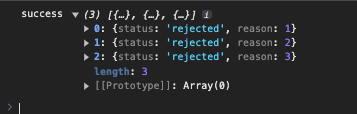

# Promise

Là 1 đối tượng JS đặc biệt, thể hiện cho sự thành công hoặc thất bại của 1 hoạt động `không đồng bộ`.

**`Promise` có những trạng thái sau**

- `pending`: trạng thái chờ ban đầu, không thành công cũng không thất bại.
- `fulfilled`: hành động đã được hoàn thành và thành công.
- `rejected`: hành động thất bại.

> Một lời hứa được cho là đã được giải quyết nếu nó được thực hiện hoặc bị từ chối, nhưng không chờ xử lý.

```js
new Promise((resolve, reject) => {
  resolve(); // hàm sẽ trả về kết quả thành công
  reject(); // hàm sẽ trả về kết quả thất bại
})
  .then(() => {
    // hàm sẽ được chạy khi promise được xử lý thành công
  })
  .catch(() => {
    // hàm sẽ được chạy khi promise xử lý thất bại
  })
  .finally(() => {
    // hàm sẽ luôn được chạy bất kể kết quả xử lý thành công hay thất bại
  });

/*
 - giá trị đối số được truyền vào trong 2 hàm resolve và reject
 - sẽ nhận được tham số tương ứng với then và catch
*/
```

```js title="Example"
new Promise((resolve, reject) => {
  reject("message loi");
})
  .then((res) => {
    console.log("1");
  })
  .catch((res) => {
    // res = "message loi"
    console.log("2");
  })
  .finally(() => {
    console.log("3");
  });

/*
- callback promise đang dùng hàm "reject" để gọi
- hàm catch sẽ được gọi
- hàm finally sẽ luôn được gọi
=> log hiển thị 2, 3
*/
```

Nếu trong các hàm `then` hoặc `catch` lại trả về tiếp 1 `Promise` thì các hàm `.then()` và `.catch()` sau đó sẽ được gọi và nhận được `res` tương ứng.

```js
new Promise((resolve, reject) => {
  resolve("đỏ");
})
  .then((res) => {
    console.log(res); // 1
    return new Promise((resolve, reject) => {
      reject("cam");
    });
  })
  .then((res) => {
    console.log(res);
  })
  .catch((res) => {
    console.log(res); // 2
    return new Promise((resolve, reject) => {
      resolve("vàng");
    });
  })
  .then((res) => {
    console.log(res); // 3
  })
  .finally(() => {
    console.log("tím"); // 4
  });

// kết quả hiển thị:  đỏ, cam, vàng, tím
```

## Promise all

Giúp chúng ta nhóm các tác vụ `bất đồng bộ` lại với nhau. Kiểm soát được 1 nhóm các `Promise`, cải thiện `hiệu năng`, rút ngắn thời gian chạy các tác vụ chạy.

```js
Promise.all([Promise1, Promise2, Promise3, ...])
 .then(result) => {
   console.log(result)
 })
 .catch(error => console.log(`Error in promises ${error}`))
```

Trong đó:

- `Promise1, Promise2, Promise3`: là các hàm xử lý `Promise`

:::info[Thông tin]

- Nếu tất cả các Promise thành công, thì sẽ trả về 1 mảng các kết quả thành công.
- Chỉ cần `1 Promise lỗi` trong danh sách các `Promise`, thì quá trình chạy sẽ bị `dừng lại` bất kể các Promise khác có thành công, sau đó trả về lỗi của `Promise` đang xảy ra lỗi.
- Promise nào có thời gian chạy trả về lỗi nhanh nhất sẽ trả về.

:::

```js
const promise1 = new Promise((resolve, reject) => {
  setTimeout(() => {
    reject("error 1");
  }, 2000);
});

const promise2 = new Promise((resolve) => {
  setTimeout(() => {
    resolve("success 2");
  }, 1000);
});

const promise3 = new Promise((resolve, reject) => {
  setTimeout(() => {
    reject("error 3");
  }, 3000);
});

Promise.all([promise1, promise2, promise3])
  .then((res) => {
    console.log(res);
  })
  .catch((err) => {
    console.log(err); // error 1
  });

// Kết quả sau khi thực thi sẽ chạy luôn vào hàm "catch"
```

**Các tình huống nên sử dụng Promise all**

1. <u>Nhiều kết quả phải sử lý đồng thời với nhau</u>

> Khi các Promise không bị dàng buộc phụ thuộc vào nhau, hãy dùng `Promise all`

2. <u>Xác minh xem nhiều kết quả yêu cầu có đáp ứng các điều kiện không</u>

3. <u>Kết hợp kết quả yêu cầu và xử lý lỗi</u>

## Promise any

Cú pháp tương tự với `Promise all`, khác ở chỗ:

- Trường hợp Promise thành công, sẽ chỉ ra 1 kết quả của Promise có thời gian chạy nhanh nhất.
- Chỉ trả về lỗi khi tất cả các Promise đều lỗi, nó sẽ đợi tất cả Promise chạy xong, rồi trả về lỗi `chung`.

```js
const promise1 = new Promise((resolve, reject) => {
  setTimeout(() => {
    resolve(1);
  }, 2000);
});

const promise2 = new Promise((resolve, reject) => {
  setTimeout(() => {
    resolve(2);
  }, 1000);
});

const promise3 = new Promise((resolve, reject) => {
  setTimeout(() => {
    resolve(3);
  }, 500);
});

Promise.any([promise1, promise2, promise3])
  .then((res) => {
    console.log("success", res);
  })
  .catch((err) => {
    console.log("fail", err);
  });

// promise3 có thời gian chạy nhanh nhất sẽ được trả về
```

## Promise race

Sẽ trả về `1 kết quả` của Promise có `thời gian chạy nhanh nhất`, `không quan tâm` đến `thành công` hay `thất bại`.

```js
const promise1 = new Promise((resolve, reject) => {
  setTimeout(() => {
    resolve(1);
  }, 2000);
});

const promise2 = new Promise((resolve, reject) => {
  setTimeout(() => {
    resolve(2);
  }, 1000);
});

const promise3 = new Promise((resolve, reject) => {
  setTimeout(() => {
    reject(3);
  }, 3000);
});

Promise.race([promise1, promise2, promise3])
  .then((res) => {
    console.log("success", res);
  })
  .catch((err) => {
    console.log("fail", err);
  });

// promise2 có thời gian chạy nhanh nhất sẽ được trả về
```

## Promise all settled

Sẽ trả về 1 mảng `tất cả` các kết quả của Promise, dù thành công hay thất bại.

Giá trị trả về luôn thành công. ( Luôn nằm trong hàm `.then` để nhận kết quả trả về, dù tất cả các Promise đều thất bại )

```js
const promise1 = new Promise((resolve, reject) => {
  setTimeout(() => {
    reject(1);
  }, 2000);
});

const promise2 = new Promise((resolve, reject) => {
  setTimeout(() => {
    reject(2);
  }, 1000);
});

const promise3 = new Promise((resolve, reject) => {
  setTimeout(() => {
    reject(3);
  }, 500);
});

Promise.allSettled([promise1, promise2, promise3])
  .then((res) => {
    console.log("success", res);
  })
  .catch((err) => {
    console.log("fail", err);
  });

// cả 3 promise đều reject, nhưng kết quả vẫn nhận được ở hàm .then
```

Kết quả:


