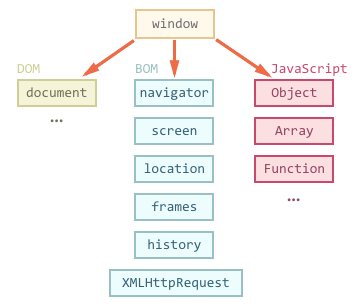

# BOM

BOM (Browser Object Model) trong JavaScript là một mô hình lập trình cung cấp các đối tượng và phương thức cho phép JavaScript tương tác với trình duyệt web.

BOM tập trung vào việc thao tác với các đối tượng của trình duyệt web như cửa sổ (window), lịch sử duyệt web (history), các thông số của trang web (location), và các tính năng khác liên quan đến môi trường trình duyệt.

- Tương tác với cửa sổ trình duyệt (mở, đóng, thay đổi kích thước, v.v.).
- Lấy thông tin về URL của trang web.
- Quản lý lịch sử duyệt web.
- Tạo và điều khiển các cửa sổ con (pop-up).
- Kiểm tra các thông tin về trình duyệt, hệ điều hành của người dùng.



## Các đối tượng chính trong BOM

### `window`: Đối tượng cửa sổ

`window` là đối tượng toàn cục đại diện cho cửa sổ trình duyệt.

Bạn có thể sử dụng đối tượng này để truy cập và điều khiển hầu hết các tính năng của trình duyệt.

Khi bạn viết mã JavaScript trong một trang web, hầu hết các đối tượng đều là thuộc tính hoặc phương thức của đối tượng window. Ví dụ: `alert()`, `setTimeout()`, `setInterval()` ...

```js
window.alert("Hello, World!");

let result = window.confirm("Bạn có muốn tiếp tục?");

// Thay đổi URL
window.location.href = "https://www.example.com";

window.setTimeout(function () {
  console.log("Hết thời gian!");
}, 2000); // chạy sau 2 giây
```

### `location`: Đối tượng địa chỉ (URL)

`window.location` là một đối tượng trong BOM cho phép bạn truy cập và thay đổi thông tin về URL của trang web hiện tại.

Đối tượng này có nhiều thuộc tính và phương thức hữu ích để điều khiển việc điều hướng giữa các trang.

```js
// Thay đổi URL, điều hướng trang
window.location.href = "https://www.example.com";

// Tải lại trang
window.location.reload();

// Thay đổi URL hiện tại mà không lưu lại lịch sử.
window.location.replace("https://www.example.com");
```

### `history`: Đối tượng lịch sử duyệt web

`window.history` là một đối tượng trong BOM giúp bạn truy cập vào lịch sử duyệt web của người dùng.

Bạn có thể sử dụng nó để điều hướng giữa các trang mà không cần phải tải lại trang.

```js
// quay lại trang trước
window.history.back();

// đi tới trang tiếp theo
window.history.forward();

// quay lại 1 trang
window.history.go(-1);

// đi tới 1 trang tiếp theo
window.history.go(1);
```

### `screen`: Đối tượng màn hình

`screen` là một đối tượng trong BOM cho phép bạn lấy thông tin về kích thước màn hình của người dùng (độ phân giải, chiều cao, chiều rộng của màn hình).

```js
// Chiều rộng màn hình của người dùng.
console.log(screen.width);

// Chiều cao màn hình của người dùng.
console.log(screen.height);
```

### `navigator`: Đối tượng trình duyệt

`navigator` là một đối tượng trong BOM cho phép bạn truy cập các thông tin về trình duyệt của người dùng, như tên trình duyệt, phiên bản, hệ điều hành

```js
// Trả về chuỗi thông tin về trình duyệt và hệ điều hành của người dùng.
console.log(navigator.userAgent);

// Trả về ngôn ngữ mặc định của trình duyệt.
console.log(navigator.language);
```

## BOM và DOM: Sự khác biệt

- `DOM (Document Object Model)` là mô hình đại diện tài liệu (HTML/XML) của trang web, giúp JavaScript thao tác với nội dung trang web.
- `BOM (Browser Object Model)` cung cấp các đối tượng giúp JavaScript tương tác với trình duyệt, như cửa sổ (window), địa chỉ (location), lịch sử duyệt web (history), và các tính năng trình duyệt khác.
