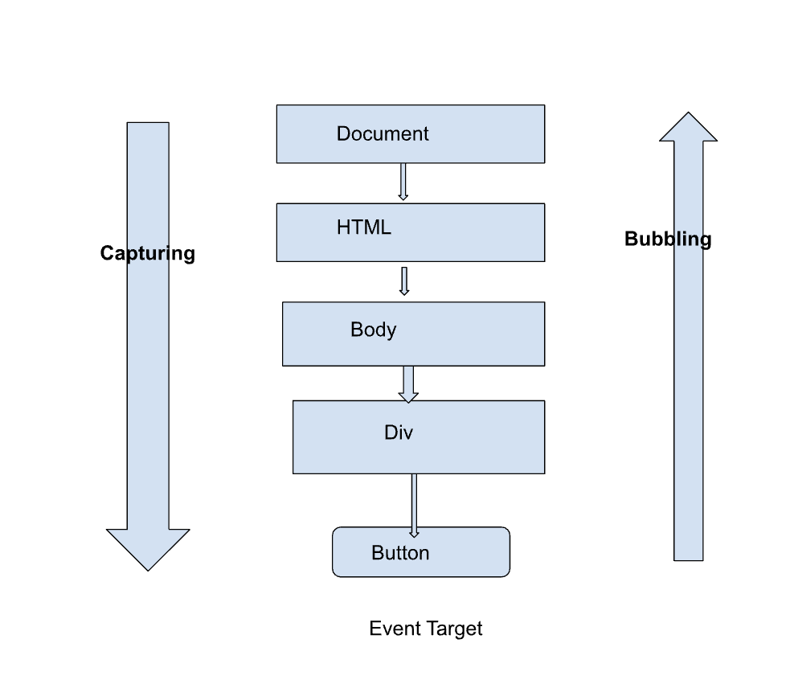

# Dom events

**DOM Event** (Sự kiện DOM) trong JavaScript là một cơ chế giúp bạn tương tác với các phần tử trên trang web. Nó xảy ra khi người dùng hoặc trình duyệt thực hiện một hành động, chẳng hạn như nhấp chuột, gõ phím, tải trang, hoặc di chuyển chuột.

## Các sự kiện phổ biến

- **Sự kiện chuột:** `click`, `dblclick`, `mousedown`, `mouseup`, `mouseover`, `mouseout`
- **Sự kiện bàn phím:** `keydown`, `keyup`, `keypress`
- **Sự kiện form:** `submit`, `focus`, `blur`, `change`
- **Sự kiện cửa sổ:** `load`, `resize`, `scroll`, `unload`

## Lắng nghe sự kiện (Event Listener)

Để xử lý một sự kiện, bạn có thể gán một trình xử lý sự kiện (event handler) cho phần tử HTML.

### Gắn trực tiếp trong HTML

```html
<button onclick="alert('Clicked!')">Click me</button>
```

### Gắn qua JavaScript bằng thuộc tính

```js
const button = document.getElementById("myButton");
button.onclick = function () {
  alert("Clicked!");
};
```

### Gắn qua `addEventListener`

```js
const button = document.getElementById("myButton");
button.addEventListener("click", () => {
  alert("Clicked!");
});
```

**Ưu điểm của `addEventListener`:**

- Gắn nhiều trình xử lý sự kiện vào cùng một phần tử.
- Hỗ trợ cả giai đoạn `Capturing` và `Bubbling`.

## Cấu trúc DOM Event

### Một sự kiện DOM có các đặc tính quan trọng:

- **Loại sự kiện:** Loại hành động xảy ra, như `click` hoặc `keydown`.
- **Đối tượng mục tiêu (`event.target`):** Phần tử mà sự kiện xảy ra.
- **Đối tượng sự kiện (`event`):** Thông tin chi tiết về sự kiện, như vị trí chuột, phím nhấn, trạng thái của các phím bổ trợ (Shift, Ctrl, Alt).

```js
document.addEventListener("click", (event) => {
  console.log("Loại sự kiện:", event.type); // click
  console.log("Phần tử mục tiêu:", event.target); // phần tử bị click
  console.log("Vị trí chuột:", event.clientX, event.clientY); // Tọa độ chuột
});
```

## Giai đoạn của sự kiện (Event Phases)

### Sự kiện DOM có ba giai đoạn:

1.  **Capturing Phase (Bắt sự kiện):** Sự kiện được truyền từ `document` xuống phần tử mục tiêu.
2.  **Target Phase (Giai đoạn mục tiêu):** Sự kiện xảy ra trên phần tử mục tiêu.
3.  **Bubbling Phase (Nổi bọt):** Sự kiện "nổi bọt" từ phần tử mục tiêu lên `document`.



### Cách chỉ định giai đoạn:

- **Mặc định:** Giai đoạn `Bubbling` (thêm `listener` bình thường).
- **Sử dụng `capture`:** Đặt tham số thứ ba trong `addEventListener` thành `true` để xử lý trong giai đoạn Capturing.

```js
const parent = document.getElementById("parent");
const child = document.getElementById("child");

parent.addEventListener(
  "click",
  () => {
    console.log("Parent clicked!");
  },
  true
); // Capturing

child.addEventListener("click", () => {
  console.log("Child clicked!");
}); // Bubbling
```

## Ngăn chặn hành vi mặc định và lan truyền sự kiện

`event.preventDefault()`: Ngăn hành vi mặc định của trình duyệt.

```js
document.querySelector("a").addEventListener("click", (event) => {
  event.preventDefault(); // Ngăn không cho chuyển hướng
  alert("Link bị chặn!");
});
```

`event.stopPropagation()`: Ngăn sự kiện tiếp tục lan truyền trong giai đoạn Capturing hoặc Bubbling.

```js
document.querySelector("#child").addEventListener("click", (event) => {
  event.stopPropagation(); // Ngăn không cho lan truyền lên phần tử cha
  alert("Child clicked!");
});
```
