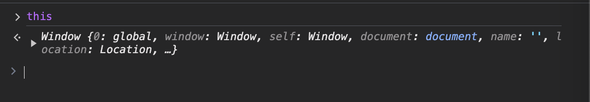
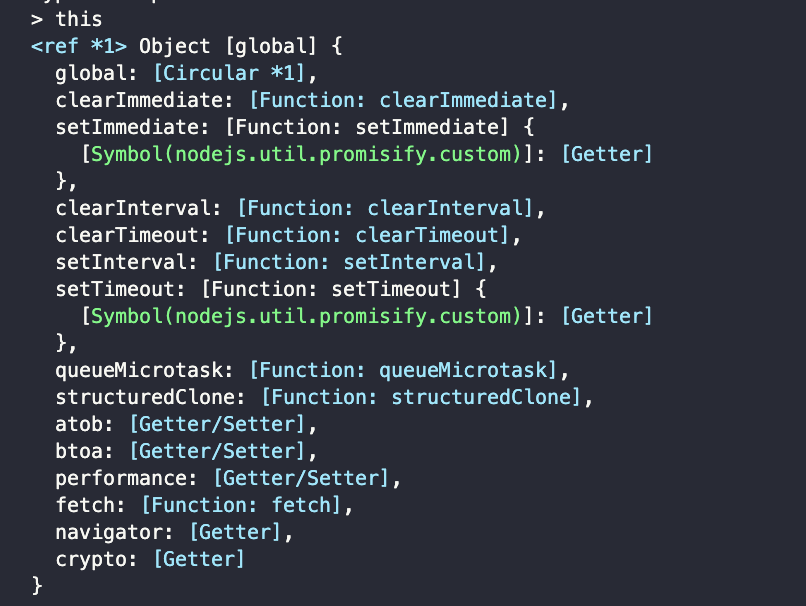
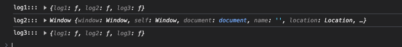

# The this keyword

Từ khóa `this` đề cập đến giá trị của đối tượng được liên kết với hàm tại thời điểm gọi nó.

Giá trị của nó khác nhau tùy thuộc vào việc một hàm được gọi như một phương thức, một hàm độc lập hay một hàm tạo.

Khi một hàm được gọi, nó sẽ làm tham chiếu đến đối tượng chứa hàm đó, cấp quyền truy cập vào các thuộc tính và phương thức được xác định cùng với nó từ trong phạm vi của nó.

## Global binding

Là phạm vi bên ngoài của 1 đối tượng hoặc của 1 đối tượng, `this` sẽ đề cập đến thuộc tính `GlobalThis`.

Trong ngữ cảnh tập lệnh chạy trong trình duyệt web, đối tượng chung là đối tượng `window`.



**Trong môi trường `Nodejs`, từ khóa `this` là đối tượng toàn cục.**



## Implicit binding

Khi một hàm được gọi như một phương thức của một đối tượng, một thể hiện của `this` bên trong phương thức đó sẽ đề cập đến đối tượng chứa phương thức đó, cấp quyền truy cập vào các phương thức và thuộc tính nằm bên cạnh nó.

```js
let myObject = {
  myValue: "This is my string.",
  myMethod() {
    console.log(this.myValue);
  },
};

myObject.myMethod(); // This is my string.
```

Bối cảnh thực thi hàm `myMethod` là đối tượng `myObject`.

> Ngữ cảnh cho giá trị của `this` là ngữ cảnh thực thi hiện tại.

### `this` in arrow functions

Trong `arrow function`, từ khóa `this` đề cập đến giá trị của `this` trong ngữ cảnh kèm theo gần nhất của hàm đó.

```js
const object = {
  log1: function () {
    return this;
  },
  log2: () => {
    /*
    - this ở đây sẽ là window
    - do ngữ cảnh bao ngoài nó không có function nào khác bao bọc
    */
    return this;
  },
  log3: function () {
    const log4 = () => {
      /*
      - this ở đây sẽ là đối tượng object
      - mặc dù đang ở trong 1 arrow function, nhưng ngữ cảnh bao ngoài lại là 1 function expression
      - nên từ khóa this sẽ lấy theo ngữ cảnh của function đó
      */
      return this;
    };
    return log4();
  },
};

console.log("log1:::", object.log1());
console.log("log2:::", object.log2());
console.log("log3:::", object.log3());
```

**Kết quả:**



## Explicit binding

Đôi khi có thể cần giá trị của `this` để thể hiện một quá trình thực thi cụ thể ngữ cảnh, thay vì ngữ cảnh giả định.

`call`, `bind`, `apply` là các method của `function` (`function như là 1 object nên sẽ có method`) dùng để thay đổi vai trò của 1 đối tượng trong hàm.

```js
const myObject = {
  myString: "This is my string.",
  myMethod() {
    console.log(this.myString);
  },
};
myObject.myMethod(); // This is my string.

setTimeout(myObject.myMethod, 100); // undefined
```

### call

Phương thức `call`, dùng để xác định tham số `this` cho 1 function.

```js
B.call(A, argument1, argument2, ...)

/*
- A: 1 đối tượng
- B: 1 hàm (function)
- argument: các đối số truyền vào trong hàm B
=> Object A áp dụng phương thức B
*/
```

```js
const book = {
  name: "Cuộc đời không phụ lòng người nỗ lực",
  price: 1000,
};

const getName = function (msg) {
  console.log(`${msg} ${this.name}`);
};

getName.call(book, "Tên sách:"); // Tên sách: Cuộc đời không phụ lòng người nỗ lực
```

### apply

Tương tự như `call`, chỉ khác đối số truyền vào là 1 mảng các giá trị.

```js
B.apply(A, [argument1, argument2, ...])

/*
- A: 1 đối tượng
- B: 1 hàm (function)
- argument: 1 'mảng' các đối số truyền vào trong hàm B
=> Object A áp dụng phương thức B
*/
```

### bind

Khác với cả `call`, `apply`, `bind` sẽ không thực thi ngay lập tức, mà nó sẽ trả về giá trị và sau đó sử dụng giá trị đó để thực thi.

Gán giá trị và thực hiện sau.

```js
const book = {
  name: "Cuộc đời không phụ lòng người nỗ lực",
  price: 1000,
};

const getName = function (msg) {
  console.log(`${msg} ${this.name}`);
};

const getNameBind = getName.bind(book);
getNameBind("Sách:"); // Sách: Cuộc đời không phụ lòng người nỗ lực
```

## Event handler binding

Trong các trình xử lý sự kiện, từ khóa `this` là giá trị tham chiếu đến đối tượng gọi nó.

Bên trong hàm gọi lại của trình xử lý sự kiện, điều đó có nghĩa là phần tử này tham chiếu đến phần tử được liên kết với trình xử lý.

```js
let button = document.querySelector("button");
button.addEventListener("click", function (event) {
  console.log(this); // chính là element được kích hoạt sự kiện
});
```

Đối với `arrow function` sẽ là `globalThis (window)` hoặc `undefined` trong chế độ `strict mode`

```js
let button = document.querySelector("button");

button.addEventListener("click", (event) => {
  console.log(this);
});
```
