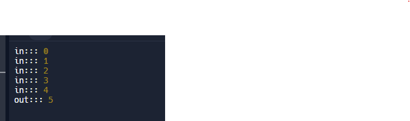

# For loop

Vòng lặp, dùng để duyệt qua các phần tử của mảng.

Thực thi 1 khối mã nhiều lần.

## For

Là vòng lặp `xác định trước được số lần lặp` của 1 mảng.

```js
for (initialization; condition; update) {
  // Mã lệnh cần thực thi trong mỗi lần lặp
}

// VD
for (let i = 1; i <= 10; i++) {
  console.log(i);
}

// 1, 2, 3, 4, 5, 6, 7, 8, 9, 10
```

- initialization (Khởi tạo): Thường dùng để khởi tạo một biến đếm, ví dụ như let i = 0. Phần này chỉ được thực thi một lần, trước khi vòng lặp bắt đầu.

- condition (Điều kiện): Là điều kiện để tiếp tục vòng lặp. Điều kiện `true` sẽ tiếp tục vòng lặp, `false` sẽ kết thúc vòng lặp. Mỗi lần lặp, điều kiện này sẽ được kiểm tra.

- update (Cập nhập): Thường được sử dụng để thay đổi giá trị của biến đếm sau mỗi lần lặp, `ví dụ như i++ (tăng biến i lên 1)`. Phần này được thực thi sau mỗi lần lặp, ngay trước khi điều kiện được kiểm tra lại.

**Thứ tự thực hiện của vòng lặp `for`**

1. initialization: sẽ được chạy đầu tiên.

2. condition: kiểm tra điều kiện.

- Nếu điều kiện `true`, logic bên trong vòng lặp sẽ được thực thi.
- Nếu điều kiện `false`, kết thúc vòng lặp và không chạy logic bên trong.

3. update: cập nhập lại biến đếm và quay lại kiểm tra điều kiện.

Quá trình này sẽ được lặp đi lặp lại đến hết vòng lặp ( điều kiện trả về `false` ).

```js
for(let i = 0, i < 5; j++) {
  console.log(i);
}

// 0, 1, 2, 3, 4
/**
 * khởi tạo biến tạo với i = 0
 * kiểm tra điều kiến: 0 < 5 ( true )
 * hiển thị log với i = 0
 * tăng giá trị khởi tạo lên 1 đơn vị 0 + 1
 * quay lại tiếp tục kiểm tra điều kiện
 * ....
 * kiểm tra điều kiến: 5 < 5 ( flase )
 * kết thúc vòng lặp
 * /
```

### Note

1. Nên sử dụng từ khóa `let` để khai báo biến khởi tạo cho vòng lặp.

```js
for (var i = 0; i < 5; i++) {
  console.log("in:::", i);
}
console.log("out:::", i);
```



Do từ kháo `var` là `global` nên giá trị `i` vẫn có thể in được ở bên ngoài vòng lặp.

- Bị trùng tên biến với giá trị khởi tạo -> lỗi

Dùng `const` sẽ gay ra lỗi, do từ khóa `const` không thể gán lại lại giá trị mới.

**Cách tốt nhất là: Dùng từ khóa `let` để khai báo.**

## For in

## For of
