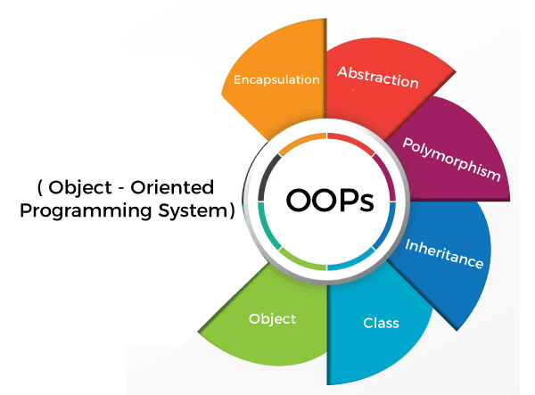

# Intro

Lập trình hướng đối tượng (`Object Oriented Programming – OOP`) là một trong những kỹ thuật lập trình rất quan trọng, được sử dụng phổ biến ngày nay.

## What is OOP

Lập trình hướng đối tượng (`OOP`) là một kỹ thuật lập trình cho phép lập trình viên tạo ra các `đối tượng` trong code trừu tượng hóa các đối tượng.

Đối tượng là những sự vật, sự việc mà nó có những tính chất, đặc tính, hành động giống nhau và ta gom góp lại thành đối tượng giống trong thực tế cuộc sống. Khi lập trình OOP, chúng ta sẽ định nghĩa các lớp (class) để gom (mô hình) các đối tượng thực tế.

### Object

Một đối tượng bao gồm 2 thông tin: thuộc tính và phương thức.

- Thuộc tính (`attribute`) chính là những thông tin, đặc điểm của đối tượng.

  > Ví dụ: con người có các đặc tính như mắt, mũi, tay, chân

- Phương thức (`method`) là những thao tác, hành động mà đối tượng đó có thể thực hiện.

  > Ví dụ: một người sẽ có thể thực hiện hành động nói, đi, ăn, uống, . . .

### Class

Là 1 nhóm, 1 tập hợp các đối tượng có chung đặc điểm, thuộc tính, hành động

## Difference between class and object

Có thể hiểu lớp nó là 1 khuẩn mẫu và đối tượng là một thực thể thể hiện dựa trên khuôn mẫu đó.

## Basic principles of OOP

### Encapsulation

- Đóng gói là quá trình gói gọn dữ liệu và các phương thức thao tác dữ liệu trong một đối tượng, giúp bảo vệ dữ liệu khỏi bị truy cập hoặc thay đổi trực tiếp từ bên ngoài.
- Đóng gói giúp bảo vệ tính toàn vẹn của dữ liệu. Các chi tiết bên trong đối tượng chỉ có thể được truy cập thông qua các phương thức được cung cấp, giảm thiểu rủi ro lỗi và bảo mật dữ liệu tốt hơn.

### Inheritance

- Kế thừa cho phép một lớp (class) con có thể kế thừa các thuộc tính và phương thức từ một lớp cha. Lớp con có thể mở rộng hoặc thay đổi hành vi của lớp cha để phù hợp với nhu cầu riêng.
- Kế thừa giúp tái sử dụng mã nguồn, giảm bớt công sức và tránh trùng lặp khi tạo các lớp có tính năng tương tự nhau.

### Polymorphism

- Đa hình cho phép các đối tượng thuộc các lớp khác nhau có thể sử dụng các phương thức có cùng tên nhưng có thể thực hiện những hành động khác nhau. Điều này thường được thực hiện qua các phương thức ghi đè (overriding) hoặc nạp chồng (overloading).
- Đa hình giúp linh hoạt hơn trong việc sử dụng các đối tượng khác nhau theo một giao diện chung, hỗ trợ tối ưu hóa và mở rộng chương trình dễ dàng.

### Abstraction

- Trừu tượng hóa là việc che giấu các chi tiết cài đặt phức tạp và chỉ hiển thị các chức năng cần thiết của đối tượng. Các lớp trừu tượng (abstract class) hoặc giao diện (interface) thường được dùng để thực hiện tính trừu tượng.
- Trừu tượng hóa giúp tập trung vào các tính năng quan trọng của đối tượng và giảm sự phức tạp, làm cho hệ thống dễ hiểu và dễ bảo trì hơn.
