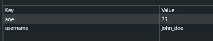

# Local storage

Local Storage là một tính năng trong Web Storage API của JavaScript, cho phép lưu trữ dữ liệu dạng `key-value` trong trình duyệt của người dùng một cách lâu dài (persistent).

Điều này có nghĩa là dữ liệu được lưu trữ trong localStorage sẽ không bị xóa khi người dùng đóng trình duyệt hoặc tải lại trang.

Local Storage là một giải pháp tuyệt vời để lưu trữ dữ liệu mà bạn muốn duy trì trên trình duyệt của người dùng mà không cần phải gửi chúng tới máy chủ.

## Đặc điểm của Local Storage

- **Lưu trữ dữ liệu trong trình duyệt**: Dữ liệu được lưu trong localStorage được lưu trữ ngay trong trình duyệt của người dùng (không cần server).
- **Không có thời gian hết hạn**: Dữ liệu sẽ được lưu trữ mãi cho đến khi người dùng xóa chúng, dù cho trang web được tải lại hay trình duyệt được đóng lại.
- **Dữ liệu dạng key-value**: Local Storage lưu trữ dữ liệu dưới dạng các cặp khóa (`key`) và giá trị (`value`). Mỗi giá trị phải là một chuỗi (`string`), tuy nhiên bạn có thể sử dụng `JSON` để lưu trữ các đối tượng phức tạp.
- **Dung lượng giới hạn**: Dung lượng lưu trữ trong localStorage thường là 5-10MB, tùy thuộc vào trình duyệt.
- **Truy cập đồng bộ**: Việc truy cập và ghi dữ liệu trong localStorage diễn ra đồng bộ (synchronous), có thể gây ảnh hưởng đến hiệu suất nếu lưu trữ hoặc truy xuất một lượng lớn dữ liệu.

## Các phương thức chính của Local Storage

### `localStorage.setItem(key, value)`

Phương thức này dùng để lưu trữ dữ liệu. Tham số key là tên của khóa (một chuỗi) và value là giá trị mà bạn muốn lưu trữ (cũng phải là chuỗi).

```js
localStorage.setItem("username", "john_doe");
localStorage.setItem("age", "25");
```



### `localStorage.getItem(key)`

Phương thức này dùng để lấy giá trị từ localStorage dựa trên khóa (key). Nếu khóa không tồn tại, nó sẽ trả về `null`.

```js
let username = localStorage.getItem("username");
console.log(username); // "john_doe"
```

### `localStorage.removeItem(key)`

Phương thức này dùng để xóa một cặp key-value khỏi localStorage dựa trên khóa (`key`).

```js
localStorage.removeItem("username");
```

### `localStorage.clear()`

Phương thức này xóa tất cả các dữ liệu trong localStorage, không cần chỉ định khóa.

```js
localStorage.clear();
```

### `localStorage.length`

Thuộc tính này trả về số lượng các mục (key-value pairs) trong localStorage.

```js
console.log(localStorage.length);
```

### `localStorage.key(index)`

Phương thức này trả về khóa (key) tại chỉ mục nhất định. Chỉ mục được truyền vào là một số (index).

```js
let firstKey = localStorage.key(0);
console.log(firstKey); // Khóa của mục đầu tiên
```

## Lưu trữ các kiểu dữ liệu phức tạp

- Sử dụng `JSON.stringyfi` để truyển đổi sang chuỗi trước khi lưu và localStorage.
- Sử dụng `JSON.parse` để truyển đổi từ chuỗi sang kiểu dữ liệu thật của giá trị.

```js
// Lưu đối tượng trong localStorage
let user = {
  name: "John Doe",
  age: 30,
};

localStorage.setItem("user", JSON.stringify(user));

// Lấy đối tượng từ localStorage
let storedUser = JSON.parse(localStorage.getItem("user"));
console.log(storedUser.name); // "John Doe"
```

## Ưu điểm và Nhược điểm của Local Storage

### Ưu điểm:

- **Lưu trữ lâu dài**: Dữ liệu được lưu trữ trong localStorage sẽ không bị mất khi người dùng đóng cửa sổ trình duyệt hoặc tải lại trang.
- **Đơn giản và dễ sử dụng**: Local Storage rất dễ để sử dụng với API đơn giản, giúp lập trình viên lưu trữ dữ liệu trong trình duyệt mà không cần phải sử dụng cơ sở dữ liệu phức tạp.
- **Không cần server**: Dữ liệu được lưu trữ hoàn toàn trong trình duyệt, giúp giảm tải cho server và không cần kết nối mạng.
- **Dung lượng lớn**: Local Storage có dung lượng lưu trữ lớn hơn nhiều so với cookies (5-10MB so với 4KB trong cookies).

### Nhược điểm:

- **Không bảo mật**: Local Storage không được mã hóa và có thể dễ dàng truy cập và thay đổi bởi các script trên trang web, do đó không nên lưu trữ các thông tin nhạy cảm như mật khẩu hoặc thông tin thanh toán.
- **Không thể chia sẻ giữa các trình duyệt**: Dữ liệu trong localStorage chỉ có thể truy cập được trên một trình duyệt duy nhất và một thiết bị duy nhất.
- **Giới hạn dung lượng**: Mặc dù dung lượng của localStorage khá lớn so với cookies, nhưng vẫn có giới hạn (thường là 5-10MB), có thể không đủ cho các ứng dụng web phức tạp cần lưu trữ dữ liệu lớn.
- **Không hỗ trợ trong tất cả các môi trường**: Nếu người dùng tắt hoặc không hỗ trợ localStorage (ví dụ, trong chế độ riêng tư của một số trình duyệt), bạn sẽ không thể sử dụng tính năng này.

## Lưu ý khi sử dụng Local Storage

- **Lưu trữ thông tin không nhạy cảm**: Tránh lưu trữ các thông tin nhạy cảm trong localStorage, vì nó có thể dễ dàng bị truy cập bởi các bên thứ ba thông qua JavaScript. Nếu cần lưu trữ mật khẩu hoặc dữ liệu quan trọng, hãy sử dụng các phương pháp bảo mật khác như mã hóa.
- **Quản lý dung lượng**: Tránh lưu trữ quá nhiều dữ liệu trong localStorage, vì nó có giới hạn dung lượng, và có thể ảnh hưởng đến hiệu suất của ứng dụng.
- **Kiểm tra sự tồn tại của dữ liệu**: Trước khi truy cập dữ liệu từ localStorage, hãy luôn kiểm tra xem dữ liệu đó có tồn tại không, tránh gây lỗi khi dữ liệu không có trong localStorage.
