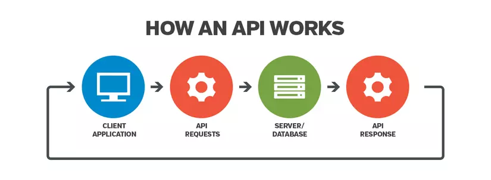

# Api

`API` là cơ chế cho phép 2 phần mềm giao tiếp với nhau bằng một tập hợp các định nghĩa và giao thức.

API là viết tắt của Giao diện lập trình ứng dụng (`Application Programming Interface`).

## How the API works

API được xây dựng trên chính 2 thành phần: Request và Reponse

## Request

### URL (endpoints)

Là địa chỉ điểm cuối cho yêu cầu, thường là đường dẫn tới một hàm xử lí logic.

### Method

Các HTTP method được sử dụng, tùy vào mục đich sử dụng với yêu cầu.

- GET: Lấy dữ liệu
- POST: Tạo mới dữ liệu và gửi lên thông qua `body`
- ....

### Headers

Các thông tin cần thiết của 1 request

> Có thể dùng `Headers` xác thực người dùng thông qua accessToken

### Body

Nơi mà dữ liệu thông tin `client` muốn gửi lên `server`

## Response

Sau khi nhận được request từ phía client, server sẽ xử lý cái request đó và gửi ngược lại cho client 1 cái response.

Phản hồi này thường chứa kết quả của thao tác mà client yêu cầu, chẳng hạn như dữ liệu, mã trạng thái, hoặc thông báo lỗi.

Phản hồi có thể ở nhiều dạng khác nhau, phổ biến nhất là JSON hoặc XML, tùy thuộc vào cách API được thiết kế.

### Status code

Phản hồi của `API` sẽ bao gồm một mã trạng thái HTTP để chỉ ra kết quả của yêu cầu. Một số mã trạng thái phổ biến là:

- `200 OK`: Yêu cầu đã được xử lý thành công.
- `201 Created`: Một tài nguyên mới đã được tạo thành công.
- `400 Bad Request`: Yêu cầu có lỗi (thường là do đầu vào không hợp lệ).
- `401 Unauthorized`: Người dùng chưa được xác thực hoặc không có quyền truy cập.
- `404 Not Found`: Tài nguyên yêu cầu không tồn tại.
- `500 Internal Server Error`: Có lỗi xảy ra bên trong server.
- ....
