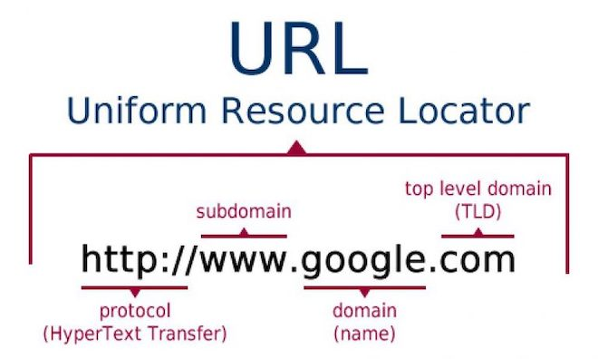

## Domain

Domain (Tên miền) là một địa chỉ dễ nhớ dùng để xác định một website trên Internet. Thay vì sử dụng địa chỉ IP phức tạp (ví dụ: 192.168.1.1), tên miền cung cấp một cách truy cập thân thiện với người dùng, như:

`www.google.com` hoặc `www.facebook.com`.

### Cấu trúc của tên miền:

Tên miền bao gồm nhiều phần, được phân cách bởi dấu chấm, từ trái qua phải:

- **Subdomain (Tên miền phụ):** Là phần mở rộng ở đầu, ví dụ: `www` trong `www.google.com`.
- **Domain chính:** Là tên chính mà người dùng chọn, ví dụ: `google` trong `google.com`.
- **Top-Level Domain (TLD):** Là phần cuối cùng, thường biểu thị loại hình hoặc khu vực, ví dụ:
  - `.com`: Thương mại.
  - `.edu`: Giáo dục.
  - `.vn`: Việt Nam.

### DNS (Domain Name System):

Hệ thống DNS (Hệ thống phân giải tên miền) giúp chuyển đổi tên miền thành địa chỉ IP mà máy tính có thể hiểu và kết nối.

### Quy trình hoạt động:

1.  Người dùng nhập tên miền (ví dụ: `www.google.com`) vào trình duyệt.
2.  Trình duyệt gửi yêu cầu đến máy chủ DNS để tra cứu địa chỉ IP của tên miền.
3.  Máy chủ DNS trả về địa chỉ IP của máy chủ web.
4.  Trình duyệt kết nối đến máy chủ web và hiển thị nội dung.

## Subdomain

Subdomain (Tên miền phụ) là một cấp con của tên miền chính. Nó cho phép bạn tạo các phần hoặc khu vực riêng biệt trong hệ thống mà vẫn giữ liên kết với tên miền chính.

```bash
subdomain.domainname.topleveldomain
```

- `www.example.com` → `www` là một subdomain (thường dùng làm mặc định).
- `blog.example.com` → `blog` là subdomain dùng để quản lý nội dung blog.
