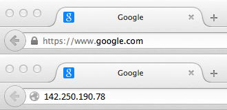

# How does the Internet work?

## Internet

`Internet` là xương sống của Web, cơ sở hạ tầng kỹ thuật giúp Web trở nên khả thi.

Về cơ bản nhất, `Internet` là một mạng lưới lớn các máy tính giao tiếp với nhau.


Khi hai máy tính cần liên lạc, bạn phải liên kết chúng, bằng vật lý (thường bằng cáp `Ethernet`) hoặc không dây (ví dụ với hệ thống `Wi-Fi` hoặc `Bluetooth`). Tất cả các máy tính hiện đại đều có thể duy trì bất kỳ kết nối nào trong số đó.

Sẽ trở nên khó khăn khi kết nối nhiều máy tính lại với nhau.


**Giải pháp**

Mỗi máy tính sẽ được kết nối đến 1 máy tính nhỏ ( được gọi là `router` )

Bộ định tuyền đảm bảo kết nối đúng tới máy tính đích.


### A network of networks

**Việc kết nối hàng trăm hàng nghìn máy tính lại với nhau thì sao**

Bộ định tuyến (`router`), cũng tương tự như máy tính, giống như bất kì 1 máy tính nào khác, vì vậy hoàn toàn có thể kết nối 2 bộ định tuyến lại với nhau, và hơn thế nữa.


Bằng cách kết nối máy tính với bộ định tuyến, sau đó là bộ định tuyến với bộ định tuyến, chúng tôi có thể mở rộng quy mô vô hạn.


Một mạng lưới như vậy cũng gần đúng với cái ta hay gọi là `Internet`.

Các đường dây điện, kết nối cơ sở hạ tầng, đường dây điện thoại được dựa vào đó để kết nối mạng.

Để kết nối mạng của chúng ta với cơ sở hạ tầng điện thoại, chúng ta cần một thiết bị đặc biệt gọi là `modem`.

Modem này biến thông tin từ mạng của chúng tôi thành thông tin có thể quản lý được bằng cơ sở hạ tầng điện thoại và ngược lại.


Sau đó sẽ kết nối mạng của nhà mình đến các nhà dịch vụ cung cấp `Internet` (Internet Service Provider, viết tắt: ISP). ISP là một công ty quản lý một số bộ định tuyến đặc biệt được liên kết với nhau và cũng có thể truy cập bộ định tuyến của các ISP khác.

Internet bao gồm toàn bộ cơ sở hạ tầng của các mạng.

> **Một số ISP tiêu biểu ở Việt Nam là VNPT, FPT, Viettel, CMC, VDC, Netnam.**


## Finding computers

Bất kì 1 máy tính nào liên kết mạng cũng đều có 1 địa chỉ `IP (Internet Protocol, giao thức Internet)` duy nhất để nhận dạng.

```js title="Example"
192.0.2.172
```

> Các máy tính giao tiếp với nhau thông qua giao thức TCP/IP

Với địa chỉ IP như vậy, máy tính hoàn toàn có thể đọc và ghi nhớ, nhưng người sử dụng lại rất khó có thể ghi nhớ.

Để dễ ghi nhớ hơn ta đặt cho nó 1 cái bí danh ( hay được gọi là `domain name, tên miền.` )



## Internet and the web

Internet là cơ sở hạ tầng kỹ thuật cho phép hàng tỷ máy tính được kết nối với nhau.

Trong số những máy tính đó, một số máy tính (được gọi là máy chủ `Web`) có thể gửi tin nhắn dễ hiểu đến trình duyệt web.

Internet là cơ sở hạ tầng, trong khi Web là dịch vụ được xây dựng trên cơ sở hạ tầng.

## Intranets and Extranets

- `Intranet` là mạng máy tính cục bộ có kiến trúc như Internet nhưng mang tính đóng và thường được dùng trong trường học, doanh nghiệp, bệnh viện, cơ sở nghiên cứu … và người dùng muốn truy cập vào thì phải có tài khoản, bảo toàn thông tin liên lạc an toàn.

- `Extranet` rất giống với Intranet, ngoại trừ việc chúng mở toàn bộ hoặc một phần mạng riêng để cho phép chia sẻ và cộng tác với các tổ chức khác. Chúng thường được sử dụng để chia sẻ thông tin một cách an toàn và bảo mật với khách hàng và các bên liên quan hợp tác chặt chẽ với doanh nghiệp. Thông thường, chức năng của chúng tương tự như chức năng được cung cấp bởi mạng nội bộ: chia sẻ thông tin và tệp, công cụ cộng tác, diễn đàn thảo luận,


