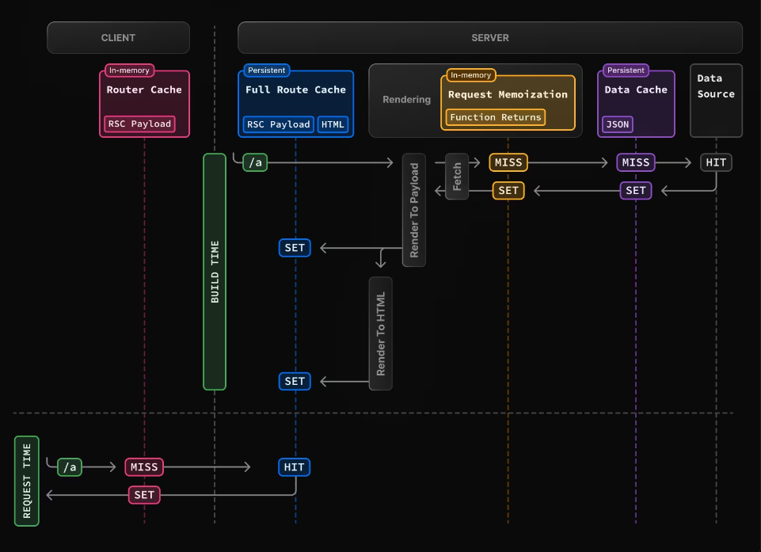
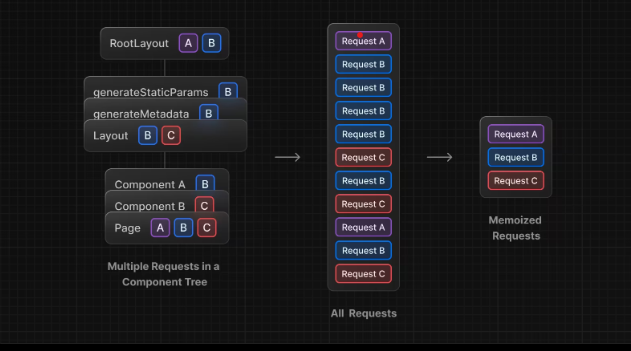
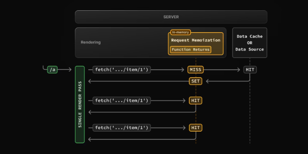
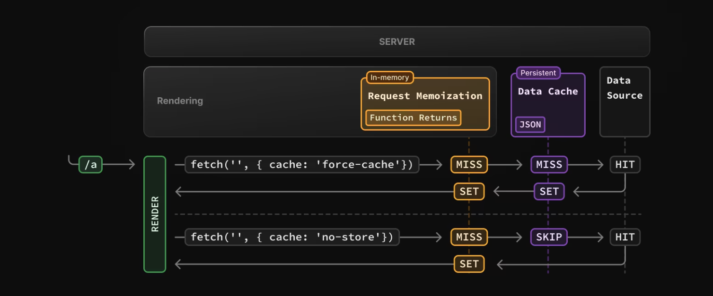

# Caching

## Caching in Next.js

Next.js cải thiện hiệu suất ứng dụng và giảm chi phí bằng cách lưu vào bộ nhớ đệm công việc kết xuất và yêu cầu dữ liệu. Theo mặc định, Next.js sẽ lưu vào bộ nhớ đệm nhiều nhất có thể để cải thiện hiệu suất và giảm chi phí.
Có nghĩa là các tuyến đường được hiển thị tĩnh và các yêu cầu dữ liệu được lưu vào bộ nhớ đệm trừ bạn hủy bỏ.



Hành vi của bộ nhớ đệm thay đổi tùy thuộc vào việc tuyến đường được hiển thị tĩnh hay động, dữ liệu được lưu vào bộ nhớ đệm hay không được lưu vào bộ đệm và liệu yêu cầu có phải là một phần của lượt truy cập đầu tiên hay điều hướng tiếp theo hay không. Tùy thuộc vào trường hợp sử dụng của bạn, bạn có thể định cấu hình hành vi lưu vào bộ nhớ đệm cho từng tuyến đường và yêu cầu dữ liệu.

## Request Memoization



> Việc ghi nhớ chỉ áp dụng cho phương thức GET trong các yêu cầu tìm nạp.

Next.js sẽ để tự động ghi nhớ các yêu cầu có cùng URL và tùy chọn khi sử dụng gọi dữ liệu.
Có nghĩa là có thể gọi dữ liệu ( `dùng hàm fetch` ) cho cùng một dữ liệu ở nhiều vị trí trong cây thành phần React trong khi chỉ thực hiện nó một lần.

> Không cần phải truyền `props` giữa các thành phần với nhau.

```tsx title="Example"
async function getData() {
  // Hàm `fetch` tự động lưu kết quả vào bộ nhớ đệm
  const res = await fetch("https://.../item/1");
  return res.json();
}

function componentA() {
  const item = await getItem();
   return {
    <div>{item.name}</div>
  }
}

function componentB() {
  const item = await getItem();
  return {
    <div>{item.price}</div>
  }
}

/*
 * Cả 2 componentA và componentB đều gọi liệu, nhưng nextjs đã lưu caching cho lần đầu tiên
 * => Không ảnh hưởng đến hiệu năng
 */
```

### Cách hoạt động của tính năng ghi nhớ yêu cầu



- Lần đầu vào trang, dữ liệu được gọi, bộ nhớ đệm chưa có dữ liệu ( `Miss` ) -> kết quả sẽ được lưu vào bộ nhớ đệm.
- Các lần tiếp theo của yêu cầu trong cùng 1 lần kết xuất ( `HIT` ), dữ liệu được trả về từ bộ nhớ đệm mà không cần gọi lại.
- Khi tuyến đường đã được hiển thị và quá trình hiển thị hoàn tất, bộ nhớ sẽ được "đặt lại" và tất cả các mục ghi nhớ yêu cầu sẽ bị xóa.

> Yêu cầu ghi nhớ là một tính năng React, không phải tính năng Next.js. Nó được đưa vào đây để cho thấy cách nó tương tác với các cơ chế lưu vào bộ nhớ đệm khác.

### Duration

Bộ đệm tồn tại trong suốt thời gian tồn tại của yêu cầu máy chủ cho đến khi component render xong.

## Data Cache

Next.js có Bộ đệm dữ liệu tích hợp sẵn để duy trì kết quả tìm nạp dữ liệu qua các yêu cầu và triển khai máy chủ đến. Vì next.js đã mở rộng hàm `fetch` api, cho phép mỗi yêu cầu trên máy chủ có bộ nhớ đệm thiết lập của riêng nó.



- Lần đầu tiên một yêu cầu tìm nạp ( `fetch` ) có tùy chọn 'force-cache' được gọi trong khi kết xuất, Next.js sẽ kiểm tra Bộ đệm dữ liệu để tìm phản hồi được lưu trong bộ nhớ đệm. Nếu phản hồi được lưu trong bộ nhớ đệm sẽ được trả về ngay lập tức.
- Nếu không tìm thấy phản hồi được lưu trong bộ nhớ đệm, yêu cầu sẽ được gửi tới nguồn dữ liệu, kết quả sẽ được lưu trữ trong Bộ nhớ đệm dữ liệu và được ghi nhớ.
- Đối với dữ liệu không được lưu vào bộ nhớ đệm ( sử dụng: `{cache: 'no-store'}` ), kết quả sẽ luôn được tìm và gọi.
- Cho dù dữ liệu được lưu vào bộ nhớ đệm hay không được lưu vào bộ đệm, các yêu cầu luôn được ghi nhớ để tránh tạo các yêu cầu trùng lặp cho cùng một dữ liệu trong quá trình kết xuất React.

**Sự khác nhau giữa `Data Cache` và `Request Memoization`**

> Cả hai cơ chế đều giúp cải thiện hiệu suất bằng cách sử dụng lại dữ liệu đã lưu trong bộ nhớ đệm, nhưng `Data Cache` vẫn tồn tại liên tục trong các yêu cầu và quá trình triển khai đến, trong khi `Request Memoization` chỉ kéo dài thời gian tồn tại của yêu cầu.

### Revalidating

#### Time-based Revalidation

`revalidate`: Xác thực lại dữ liệu theo một khoảng thời gian đã định sẵn, thời gian tồn tại của bộ đệm (tính bằng giây).

```tsx
fetch("https://...", { next: { revalidate: 3600 } });
```
