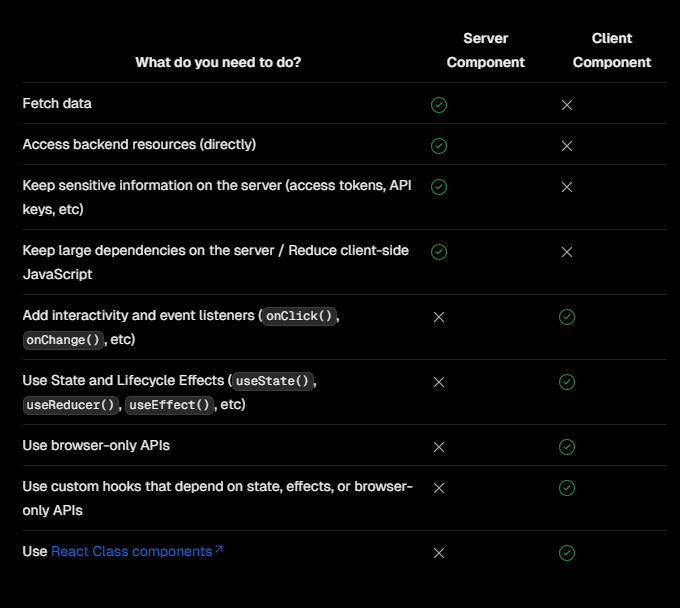

# Server and Client Composition Patterns

Cần xem xét thích hợp cho các thành phần của ứng dụng, khi nào nên dùng `Client component` và `Server component` để đạt được hiệu quả cao nhất.

### When to use Server and Client Components?



### Server Component Patterns

#### Sharing data between components

Khi `fetch` dữ liệu từ `Server component`, có thể bạn muốn truyền dữ liệu xuống các thành phần con để sử dụng, các thành phần phụ thuộc vào cùng 1 dữ liệu. Thông thường ta sẽ truyền `props` từ component `cha` xuống component `con` hoặc có thể dùng `state management`. Nhưng đối với Next.js thì sẽ không cần phải làm như vậy.

Thay vào đó ta có thể `fetch` dữ liệu ở bất cứ dầu trong component mà bạn muốn, mà không cần quan tâm đến thực thi các tìm nạp trùng lặp. Vì Next.js đã tự động ghi nhớ các yêu cầu dữ liệu vào bộ nhớ đệm.

```tsx title="Example"
// function gọi api
async function getData() {
  const res = await fetch(`https://api...`);
  const data = await res.json();
  return data;
}

async function ComponentA() {
  // gọi cùng 1 dữ trong component con
  const data = await getData();
  return <div></div>;
}

export default async function Page() {
  // gọi dữ liệu ở component cha
  const data = await getData();
  return (
    <article>
      {/* map data... */}
      <ComponentA />
    </article>
  );
}
```

#### Server only

`Server only` giúp cho các đoạn mã của chúng ta chỉ được thực hiện trên `server` và không bao giờ bị truyền xuống `client`. Đặc biệt hữu ích với các thông tin nhạy, logic phía server như: tương tác với CSDL, thư viện chỉ dành cho môi trường server, api key, refresh token.... Giúp cho ứng dụng bảo mật và an toàn hơn.

Cài đặt

```bash title="Terminal"
npm install server-only
```

```ts
import "server-only";
// import server-only

export async function getData() {
  const res = await fetch("https://external-service.com/data", {
    headers: {
      authorization: process.env.API_KEY,
    },
  });

  return res.json();
}
// Client sẽ không thể nào gọi và sử dụng được function getData này.
```

#### Using Third-party Packages

Khi sử dụng các thư viện, gói bên thứ 3, hỗ trợ cho việc xây dựng phía `Client component` cần sử dụng `use client`. Vì các thư viện, gói dó có sử dụng các tính năng `hook` của React. Nếu không sẽ bị lỗi.

```tsx
"use client";
// Thêm 'use client' vào

import { useState } from "react";
import { Carousel } from "acme-carousel";
// package carousel hỗ trợ phía client component

export default function Gallery() {
  const [isOpen, setIsOpen] = useState(false);
  return (
    <div>
      <button onClick={() => setIsOpen(true)}>View pictures</button>
      {isOpen && <Carousel />}
    </div>
  );
}
```

#### Using Context Providers

Không thể dùng `trực tiếp` `createContext` trong server component được. Cần phải tách riêng `Client component` sử dụng `createContext` và bao bọc các thành phần con dưới dạng `children`.

```tsx title="app/theme-provider.tsx"
"use client";

import { createContext } from "react";

export const ThemeContext = createContext({});

export default function ThemeProvider({
  children,
}: {
  children: React.ReactNode;
}) {
  return <ThemeContext.Provider value="dark">{children}</ThemeContext.Provider>;
}
```

```tsx
import ThemeProvider from "./theme-provider";

export default function RootLayout({
  children,
}: {
  children: React.ReactNode;
}) {
  return (
    <html>
      <body>
        <ThemeProvider>{children}</ThemeProvider>
      </body>
    </html>
  );
}
```

### Client Component Patterns

#### Moving Client Components Down the Tree

Trong 1 page sẽ gồm rất nhiều các thành phần khác nhau, nhưng đối với các thành phần tĩnh hiển thị ra giao diện `nên` dùng `Server component`, để tối ưu hiệu năng và hỗ trợ tốt cho `SEO`. Các thành phần liên quan đến tương tác hãy dùng `Client component`.

```tsx
// SearchBar is a Client Component
import SearchBar from "./searchbar";
// Logo is a Server Component
import Logo from "./logo";

// Layout trong Next.js mặc định là Server component
export default function Layout({ children }: { children: React.ReactNode }) {
  return (
    <>
      <nav>
        <Logo />
        <SearchBar />
      </nav>
      <main>{children}</main>
    </>
  );
}
```

#### Passing props from Server to Client Components (Serialization)

Có thể truyền dữ liệu từ `Server component` xuống `Client component` thông qua `props` nhưng cần phải được tuần tự hóa bởi React (`serializable`)

> Cũng có thể truyền từ `Client compomnet` xuống `Server component`.

### Interleaving Server and Client Components

Có thể linh hoạt lồng `Server component` và `Client component` với nhau nhưng cần lưu ý:

- Trong vòng đời phản hồi yêu cầu, mã của bạn sẽ di chuyển từ `server` đến `client`. Nếu bạn cần truy cập dữ liệu hoặc tài nguyên trên `server` khi đang ở trên `client`, bạn sẽ thực hiện một yêu cầu mới tới `server` - không chuyển đổi qua lại.

- Khi một yêu cầu mới được gửi tới `server`, tất cả `server component` sẽ được hiển thị trước tiên, bao gồm cả những thành phần được lồng bên trong `Client component`. Kết quả được hiển thị (Tải trọng RSC) sẽ chứa các tham chiếu đến vị trí của `Client component`. Sau đó, trên `client`, React sử dụng Tải trọng RSC để điều hòa các `Server component` và `Client component` thành một cây duy nhất.

- Vì `Client component` được hiển thị sau `Server component` nên bạn không thể nhập `Server component` vào mô-đun `Client component`. Thay vào đó có thể truyền `Server component` dưới dạng `props` hoặc `children` cho `Client component`.

```tsx title="VD sẽ xảy ra lỗi nếu nhập trực tiếp"
"use client";
import ServerComponent from "./Server-Component";
// Không thể nhập trực tiếp ServerComponent vào ClientComponent

export default function ClientComponent({
  children,
}: {
  children: React.ReactNode;
}) {
  const [count, setCount] = useState(0);
  return (
    <>
      <button onClick={() => setCount(count + 1)}>{count}</button>
      <ServerComponent />
    </>
  );
}
```

```tsx title="Truyền Server component dưới dạng children"
"use client";

import { useState } from "react";

export default function ClientComponent({
  children,
}: {
  children: React.ReactNode;
}) {
  const [count, setCount] = useState(0);

  return (
    <>
      <button onClick={() => setCount(count + 1)}>{count}</button>
      {children}
    </>
  );
}
// Truyền Server component vào Client component dưới dạng children
```

```tsx title="VD hoạt động tốt"
import ClientComponent from "./client-component";
import ServerComponent from "./server-component";

// Pages trong Next.js mặc định là Server component
export default function Page() {
  return (
    <ClientComponent>
      <ServerComponent />
    </ClientComponent>
  );
}
// ClientComponent bao bọc ServerComponent dưới dạng children
```
