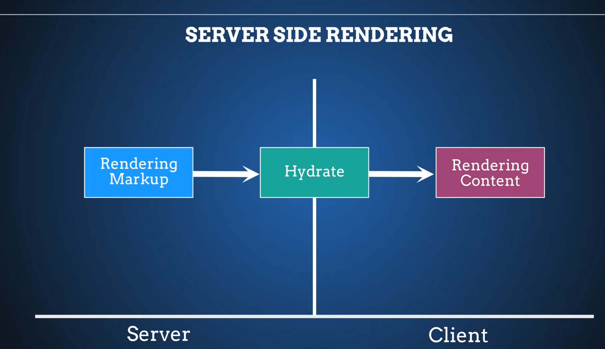
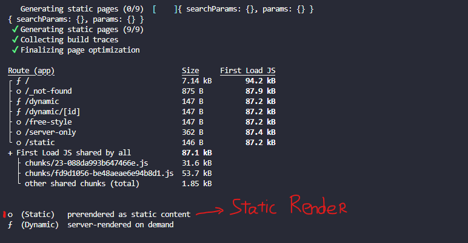
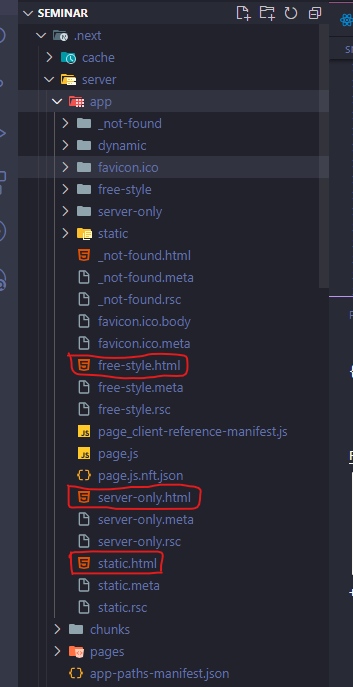
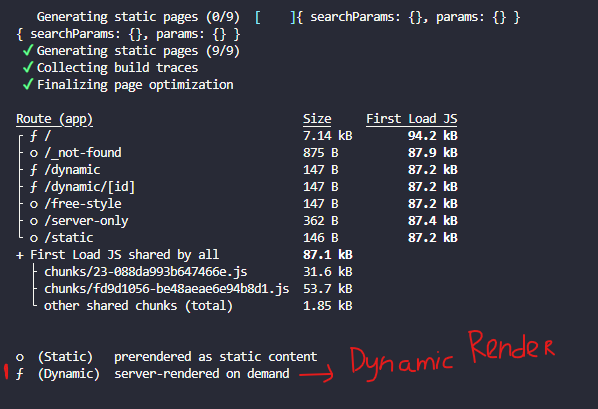
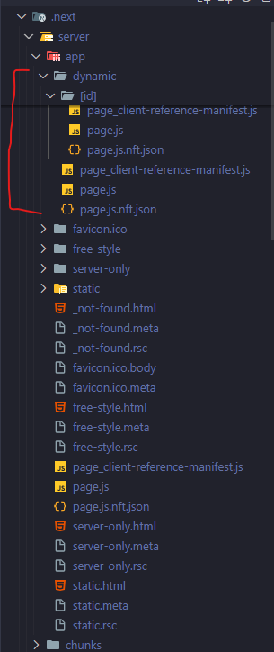
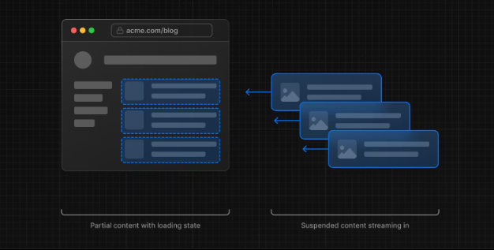

# Server Component

Cho phép giao diện của người dùng được kết xuất và lưu vào bộ nhớ đệm ở phía máy chủ.

## Benefits of Server Rendering

- `Data Fetching`: cho phép bạn di chuyển tìm nạp dữ liệu đến máy chủ, gần nguồn dữ liệu của bạn hơn. Giảm thời gian tìm nạp dữ liệu cần thiết để hiển thị và số lượng mà người dùng yêu cầu.
- `Security`: cho phép lưu giữ dữ liệu và logic nhạy cảm trên máy chủ, chẳng hạn như mã thông báo và khóa API mà không có nguy cơ để lộ chúng cho máy khách.
- `Caching`: với việc kết xuất phía server, kết quả có thể được lưu vào bộ nhớ đệm và sử dụng lại cho các yêu cầu tiếp theo. Cải thiện hiệu suất và giảm chi phí tìm nạp dữ liệu trên mỗi yêu cầu.
- `Performance`: nhờ việc có thể lưu dữ liệu vào bộ nhớ đệm, sẽ giúp việc tìm nạp dữ liệu nhanh hơn, cải thiện hiệu năng của ứng dụng.
- `Initial Page Load and First Contentful Paint`: Phía máy chủ có thể tạo HTML để cho phép người dùng xem trang ngay lập tức mà không cần đợi máy khách tải xuống, phân tích cú pháp và thực thi JavaScript cần thiết để hiển thị trang.
- `Search Engine Optimization and Social Network Shareability`: Hỗ trợ tốt cho việc SEO ứng dụng.
- `Streaming`: Thành phần máy chủ cho phép bạn chia công việc kết xuất thành nhiều phần và truyền chúng đến máy khách khi chúng sẵn sàng. Điều này cho phép người dùng xem các phần của trang sớm hơn mà không cần phải đợi toàn bộ trang được hiển thị trên máy chủ.

## Using Server Components in Next.js

> Theo mặc định next.js đã cấu hình `Server component`. Điều này cho phép tự động triển khai kết xuất máy chủ mà không cần cấu hình bổ sung.

## Server Components rendered?



1. Yêu cầu HTTP từ client.
   > Khi người dùng gửi yêu cầu truy cập trang chứa Server Component, yêu cầu HTTP sẽ được gửi đến server Next.js. Đây là thời điểm mà Next.js quyết định liệu trang đó sẽ được render từ server hay client dựa trên loại component.
2. Xử lý trên server, bao gồm lấy dữ liệu và render component.
   > Nếu trang chứa Server Component, quá trình xử lý sẽ diễn ra hoàn toàn trên server. Các Server Components không gửi JavaScript đến client, thay vào đó chỉ gửi HTML đã render sẵn. Quá trình này bao gồm:
   > Data Fetching: Tại server, Next.js sẽ xử lý việc lấy dữ liệu cần thiết cho trang.
   > Rendering: Sau khi có dữ liệu, Server Component được render trên server thành HTML. Lưu ý rằng không có mã JavaScript nào liên quan đến các Server Component được gửi đến client.
3. Server trả về HTML đã render cho client.
   > Next.js gửi HTML đã render đến client, cùng với mã CSS và các asset khác nếu cần thiết. Vì các Server Component đã được xử lý trên server, kết quả là client chỉ nhận về HTML tĩnh. Điều này giúp cải thiện thời gian tải trang và giảm tải JavaScript chạy trên trình duyệt.
4. Client hiển thị HTML mà không cần chạy JavaScript cho các Server Component.
   > Client sẽ nhận được HTML đầy đủ đã được render từ server, và nó có thể được hiển thị ngay lập tức mà không cần bất kỳ JavaScript bổ sung nào để render lại các Server Component.
5. Nếu có Client Component, hydration diễn ra để kích hoạt các tương tác trên client.
   > Nếu trang bao gồm cả Client Components (những component yêu cầu tương tác trực tiếp từ người dùng hoặc xử lý trên trình duyệt), Next.js sẽ gửi mã JavaScript của các Client Components đó đến client. Sau đó, quá trình hydration sẽ diễn ra, nghĩa là Next.js sẽ gắn các sự kiện và logic cho các Client Components khi trang đã được tải trên client.
6. Sử dụng Server Components giúp giảm lượng JavaScript cần tải và xử lý trên client, cải thiện hiệu năng tổng thể.

## Server Rendering Strategies

Next.js được chia làm 3 dạng render chính

- `Static`: Trang HTML được tạo sẵn trong quá trình build, thích hợp cho nội dung ít thay đổi.
- `Dynamic`: Trang được render tại thời gian chạy ( runtime ) khi có yêu cầu từ người dùng, phù hợp cho nội dung động.
- `Streaming`: Render từng phần của trang và gửi từng phần về client, giúp tối ưu hiệu suất và trải nghiệm người dùng khi xử lý phức tạp.

### Static Rendering (Default)

- `Static rendering` rất hữu ích khi tuyến đường có dữ liệu tĩnh, ít có sự thay đổi cập nhập, chẳng hạn như bài đăng blog tĩnh hoặc trang sản phẩm.
- Khi chạy lệnh `npm run build` trong dự án Next.js, sẽ thấy những file được có ký hiệu `o` ở đầu là những file được render với cơ chế `static`.

  

- Khi thực hiện build xong, trong thư mục build, sẽ chứa luôn file `.html` tương ứng với các file được render với cơ chế `static`.

  

> Next.js sẽ dùng `Static rendering` khi có thể, đây là cơ chế mặc định.

:::tip [Lưu ý]
Chúng ta dùng `dynamic function` trong page sẽ bị chuyển sang `Dynamic rendering`

- cookies()
- headers()
- unstable_noStore()
- unstable_after():
- searchParams prop

:::

### Dynamic Rendering

Ngược lại với `Static rendering`, `Dynamic Rendering` sẽ được render tại thời điểm người dùng yêu cầu ( vd: `truy cập vào trang detail, tại thời điểm đó trang mới bắt đầu được render` )

Được có ký hiệu `f` ở đầu là những file được render với cơ chế `dynamic`.



Và ở trong thư mục build sẽ `không` có file `.html` tương ứng.



### Streaming

Hiển thị dần dần giao diện người dùng từ máy chủ. tới khi client sẵn sàng hiển thị. Điều này cho phép người dùng xem các phần của trang ngay lập tức trước khi toàn bộ nội dung hiển thị xong.



Có thể sử dụng file `loading.js` và `React Suspense` để thực hiện cơ chế này.

```tsx
// component sẽ được streaming rendering
async function ListProduct() {
  const products = await getListProducts();
  return (
    <div className="flex gap-5">
      {products.map((item) => (
        <div key={item.id} className="border p-2">
          {item.name}
        </div>
      ))}
    </div>
  );
}

export default async function page({ params }: { params: { id: string } }) {
  const product = await getProduct(params.id);
  return (
    <>
      <div className="border w-fit p-3">
        <p>name: {product.name}</p>
      </div>
      {/* steaming render */}
      <Suspense fallback={<div>Loading...</div>}>
        <ListProduct />
      </Suspense>
    </>
  );
}
```

Trong ví dụ trên khi tải lại trang, `loading` trong `fallback` của `Suspense` sẽ được hiển thị trước, khi nào dữ liệu đã tải xong thì mới bắt đầu hiển thị dữ liệu thật.

> Phù hợp với các page có logic xử lý phức tạp cần thời gian code xử lý và chạy.
