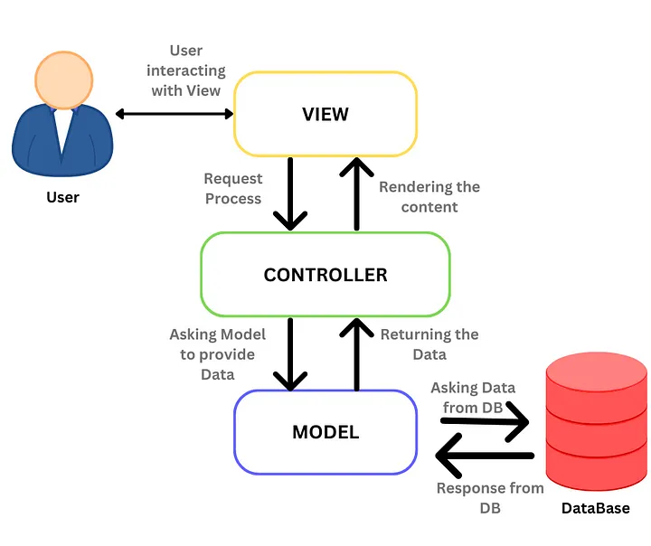

Mô hình **MVC (Model-View-Controller)** là một kiến trúc phần mềm được sử dụng rộng rãi trong phát triển ứng dụng, đặc biệt là ứng dụng web. MVC phân chia ứng dụng thành ba thành phần chính để giúp tổ chức mã nguồn một cách hiệu quả, dễ bảo trì và mở rộng.

Được áp dụng rất nhiều thiết kế hệ thống bên BE ( Nodejs, PHP... )

## Model

- Có nhiệm vụ thao tác với Database
- Nó chứa tất cả các hàm, các phương thức truy vấn trực tiếp với dữ liệu
- Controller sẽ thông qua các hàm, phương thức đó để lấy dữ liệu rồi gửi qua View

## View

- Là giao diện người dùng (User Interface)
- Chứa các thành phần tương tác với người dùng như menu, button, image, text,...
- Nơi nhận dữ liệu từ Controller và hiển thị

**Ví dụ:**

- Một trang web hiển thị danh sách sinh viên dưới dạng bảng HTML.
- View sẽ nhận dữ liệu từ Model thông qua Controller và hiển thị chúng dưới định dạng mà người dùng dễ dàng tiếp cận.

## Controller

- Là thành phần trung gian giữa Model và View
- Đảm nhận vai trò tiếp nhận yêu cầu từ người dùng, thông qua Model để lấy dữ liệu sau đó thông qua View để hiển thị cho người dùng

## Luồng hoạt động trong MVC

1.  **Người dùng** thực hiện một hành động (ví dụ: nhấn nút hoặc gửi form).
2.  **View** gửi yêu cầu đến **Controller**.
3.  **Controller** xử lý yêu cầu, tương tác với **Model** để lấy hoặc thay đổi dữ liệu.
4.  **Model** cập nhật trạng thái dữ liệu hoặc trả về thông tin cần thiết.
5.  **Controller** nhận kết quả từ Model và gửi về **View** để hiển thị.
6.  **View** hiển thị kết quả cho người dùng.

