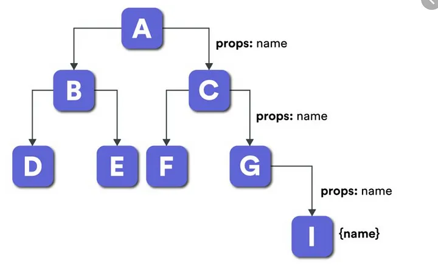

`createContext` là một API được cung cấp bởi React để quản lý và chia sẻ dữ liệu giữa các thành phần (components) mà không cần truyền props qua từng cấp của cây thành phần (component tree).

Đây là một giải pháp thay thế cho việc truyền props theo kiểu "prop drilling", đặc biệt khi bạn cần chia sẻ dữ liệu cho nhiều thành phần ở các cấp khác nhau.



## Cách sử dụng `createContext`

1.  **Tạo một Context bằng `React.createContext`.**
2.  **Sử dụng `Provider` để cung cấp giá trị cho Context.**
3.  **Dùng `useContext` hoặc `Consumer` để lấy giá trị từ Context.**

### Tạo Context

```jsx
import React, { createContext } from "react";

const UserContext = createContext();
export default UserContext;
```

### Sử dụng Provider

`Provider` được sử dụng để bao bọc cây thành phần và cung cấp giá trị cho Context.

```jsx
import React from "react";
import UserContext from "./UserContext";

function App() {
  const user = { name: "John", age: 30 };

  return (
    <UserContext.Provider value={user}>
      <Parent />
    </UserContext.Provider>
  );
}

function Parent() {
  return <Child />;
}
```

### Lấy giá trị từ Context

#### Sử dụng useContext (React Hook)

`useContext` là cách hiện đại và phổ biến nhất để sử dụng Context.

```jsx
import React, { useContext } from "react";
import UserContext from "./UserContext";

function Child() {
  const user = useContext(UserContext);

  return <p>Welcome, {user.name}!</p>;
}
```

#### Sử dụng Consumer (Cách truyền thống)

```js
import React from "react";
import UserContext from "./UserContext";

function Child() {
  return (
    <UserContext.Consumer>
      {(user) => <p>Welcome, {user.name}!</p>}
    </UserContext.Consumer>
  );
}
```

## Sử dụng nhiều Context trong 1 ứng dụng

```jsx
import React, { createContext, useContext } from "react";

const UserContext = createContext();
const ThemeContext = createContext();

function App() {
  const user = { name: "John", age: 30 };
  const theme = "dark";

  return (
    <UserContext.Provider value={user}>
      <ThemeContext.Provider value={theme}>
        <Child />
      </ThemeContext.Provider>
    </UserContext.Provider>
  );
}

function Child() {
  const user = useContext(UserContext);
  const theme = useContext(ThemeContext);

  return (
    <p>
      Welcome, {user.name}! Current theme: {theme}.
    </p>
  );
}
```

:::info
Khó `scale` khi dự án phình to ra, nên sử dụng các package state manager bên ngoài, để đảm bảo trực quan và mở rộng sau này.
:::

1.  **Hiệu suất:**

    - Mọi thành phần con được bọc bởi `Provider` sẽ được render lại khi giá trị của Context thay đổi, ngay cả khi giá trị đó không ảnh hưởng trực tiếp đến thành phần con.
    - Sử dụng **memoization** (`React.memo`) hoặc tách nhỏ Context khi cần thiết.

2.  **Không lạm dụng Context:**

    - Context không phải lúc nào cũng là giải pháp tối ưu. Đối với quản lý trạng thái phức tạp, bạn nên cân nhắc các thư viện như Redux, Zustand, hoặc Recoil.

3.  **Gắn `useContext` trực tiếp với thành phần:**

    - Khi sử dụng `useContext`, hãy gắn nó trực tiếp với thành phần cần giá trị để tránh truyền qua nhiều cấp.
