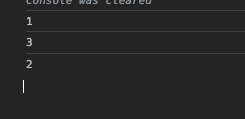
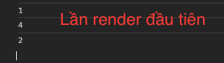
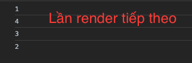

# useEffect

Là React Hook cho phép bạn đồng bộ hóa một thành phần với hệ thống bên ngoài.

Có thể tương tác được tương ứng với mỗi vòng đời của component, `mount`, `updated`, `unmount`

```jsx
useEffect(setup, dependencies?)
```

## Declare an Effect

Mỗi lần component bị render, React sẽ cập nhập hiển thị DOM ra trước và sau đó mới chạy mã bên trong `useEffect`. Nói cách khác `useEffect` sẽ trì hoãn gọi cho đến khi các thành phần DOM ảo được gắn vào.

```jsx
import { useEffect } from "react";

export default function App() {
  console.log("1");

  useEffect(() => {
    console.log("2");
  });

  return <div className="App">{console.log("3")}</div>;
}
```

Kết quả:



## Specify the Effect dependencies

> `useEffect` sẽ chạy sau mỗi lần kết xuất, đây không phải là điều mong muốn.

```jsx
useEffect(() => {
  console.log("sẽ được gọi lại mỗi khi thành phần bị render");
});
```

### Empty array

Nếu như truyền thêm 1 mảng rỗng làm đối số thứ 2 cho `useEffect`, thì lúc này `useEffect` chỉ được `chạy 1 lần duy nhất` trong lần render đầu tiên.

Những lần render sau đó `useEffect` sẽ không được chạy.

```jsx
useEffect(() => {
  console.log("sẽ chỉ chạy 1 lần duy nhất trong lần render đầu tiên");
}, []);
```

### Arrays with value dependencies

Nếu như mảng `dependencies` của `useEffect` có giá trị, thì mỗi khi giá trị trong mảng `dependencies` đó thay đổi, thì `useEffect` sẽ được gọi lại.

React sẽ chỉ bỏ qua việc chạy lại `Effect` nếu tất cả các phần phụ thuộc mà bạn chỉ định có cùng giá trị như chúng có trong lần kết xuất trước đó. React so sánh các giá trị phụ thuộc bằng cách sử dụng so sánh Object.is.

```jsx
const [count, setCount] = useState();

useEffect(() => {
  console.log("mỗi khi giá trị 'count' thay đổi thì useEffect sẽ được gọi lại");
}, [count]);
```

:::info Thông tin

```jsx
useEffect(() => {
  // chạy lại sau mỗi lần render
});

useEffect(() => {
  // chỉ chạy lần đầu tiên, khi các thành phần gắn vào DOM.
}, []);

useEffect(() => {
  // chạy lại mỗi khi dependency có sự thay đổi
}, [a, b]);
```

- Cả 3 trường hợp trên sẽ đều chạy trong lần đầu khi component render lần đầu tiên.

:::

## Clean up function

```jsx
useEffect(() => {
  return () => {
    // clean up function
  };
}, []);
```

Trong lần render đầu tiên hàm `clean up` sẽ không được gọi.

Hàm `clean up` được gọi khi:

- thành phần đó bị `unmount` khỏi DOM ( không tồn tại và hiển trên DOM )
- nếu `useEffect` được gọi ở những lần render tiếp theo, thì sau mỗi lần render `clean up` cũng sẽ được gọi ( trừ lần render đầu tiên ). `clean up` sẽ được gọi trước cả `callback` trong `useEffect`

```jsx
const [count, setCount] = useState(1);
console.log("1");

useEffect(() => {
  console.log("2");

  return () => {
    console.log("3");
  };
});

return (
  <div className="App">
    {console.log("4")}

    <p>Count: {count}</p>
    <button onClick={() => setCount((prev) => prev + 1)}>Click</button>
  </div>
);
```

Lần đầu tiên render component, `clean up` sẽ không được gọi



Khi thực hiện `click` state thay đổi và render lại component thì `clean up` sẽ được gọi.


