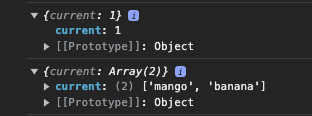

# useRef

Là React Hook cho phép bạn tham chiếu một giá trị không cần thiết để hiển thị.

```jsx
const ref = useRef(initialValue);
```

## Reference

### useRef(initialValue)

`initialValue`: Nó có thể là một giá trị thuộc bất kỳ loại nào. Đối số này bị bỏ qua sau lần hiển thị đầu tiên.

```jsx
const refNumber = useRef(1);
const refArray = useRef(["mango", "banana"]);
```

### Returns

Sẽ trả về 1 đối tượng và có 1 thuộc tính duy nhất.

- `current`: giá trị ban đầu là giá trị khởi tạo. Có thể gán lại giá trị sang 1 giá trị khác

Trong các lần render tiếp theo, useRef sẽ trả về cùng một đối tượng.



:::warning Lưu ý

- Bạn có thể thay đổi được giá trị của `ref` thông qua `ref.current`

```jsx
const refNumber = useRef(1);

useEffect(() => {
  refNumber.current = 2;
});

console.log(refNumber); // 2
```

- Khi thay đổi lại giá trị của `ref`, React sẽ `không render lại` (`khác với state`)

- Có thể lưu trữ thông tin mà không sợ mỗi lần render bị gán lại.

- Có thể truy cập nhanh element của Dom qua ref

```jsx
const refDivElement = useRef(null);

<div ref={refDivElement}>content</div>;
```

:::

## Usage

### Referencing a value with a ref

Dùng `useRef` để clear đi setTimeout hoặc setInterval

```jsx
const intervalRef = useRef(null);

function handleStart() {
  setStartTime(Date.now());
  setNow(Date.now());

  clearInterval(intervalRef.current);
  intervalRef.current = setInterval(() => {
    setNow(Date.now());
  }, 10);
}

function handleStop() {
  clearInterval(intervalRef.current);
}
```

:::warning Chú ý

```jsx

Không nên đọc hoặc ghi lại trong quá trình render

function MyComponent() {
  // 🚩 không sửa lại ref trong quá trình render
  myRef.current = 123;

  // 🚩 không đọc giá trị ref trong DOM
  return <h1>{myOtherRef.current}</h1>;
}
```

```jsx
function MyComponent() {
  useEffect(() => {
    // ✅ đọc hoặc ghi lại trong useEffect
    myRef.current = 123;
  });
  // ...
  function handleClick() {
    // ✅ có thể đọc hoặc ghi trong hàm
    doSomething(myOtherRef.current);
  }
}
```

:::

### Manipulating the DOM with a ref

Việc sử dụng ref để thao tác DOM là điều đặc biệt phổ biến.

```jsx
const inputRef = useRef(null);

function handleClick() {
  inputRef.current.focus();
}

return <input ref={inputRef} />;
```
