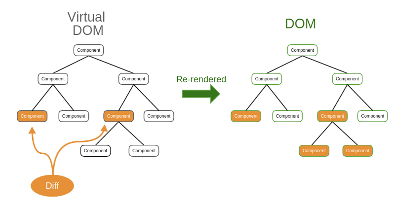

# Virtual DOM

## DOM là gì?

DOM là một cấu trúc dữ liệu dạng cây biểu diễn tài liệu HTML hoặc XML. Mỗi nút trong cây đại diện cho một phần tử (element) trên trang web. Khi trang web thay đổi (ví dụ: thêm hoặc xóa một phần tử), trình duyệt phải cập nhật DOM thực, điều này có thể tốn thời gian và làm chậm hiệu suất, đặc biệt với các ứng dụng lớn.

## Virtual DOM là gì?

Virtual DOM là một bản sao nhẹ của DOM thực, được lưu trong bộ nhớ và không trực tiếp thao tác với giao diện người dùng. React sử dụng Virtual DOM để tối ưu hóa quá trình cập nhật giao diện.

## Cách hoạt động của Virtual DOM:

- **Tạo Virtual DOM:** Khi trạng thái (state) hoặc thuộc tính (props) của một component thay đổi, React sẽ tạo một Virtual DOM mới phản ánh giao diện sau thay đổi.

- **So sánh (Diffing):** React so sánh Virtual DOM mới với phiên bản trước đó để xác định những thay đổi cần được thực hiện (quá trình này gọi là _reconciliation_).

- **Cập nhật DOM thực:** Sau khi phát hiện thay đổi, React thực hiện các cập nhật cần thiết trên DOM thực, chỉ sửa đổi những phần tử bị thay đổi thay vì làm mới toàn bộ giao diện.

## Cách Virtual DOM hoạt động trong React?

1.  **Khi dữ liệu thay đổi:** React sẽ tạo ra một Virtual DOM mới dựa trên dữ liệu mới.
2.  **So sánh:** React so sánh Virtual DOM mới với Virtual DOM cũ để tìm ra những phần tử nào đã thay đổi.
3.  **Cập nhật DOM thật:** React chỉ cập nhật những phần tử khác biệt trên DOM thật.
4.  **Render lại:** Trình duyệt render lại những phần tử đã được cập nhật.

## Lợi ích của Virtual DOM:

- **Hiệu suất cao hơn:** Vì React chỉ cập nhật các phần tử bị thay đổi, quá trình thao tác DOM trở nên nhanh hơn.
- **Trải nghiệm người dùng tốt:** Ứng dụng phản hồi mượt mà hơn nhờ tối ưu hóa các thao tác DOM.
- **Dễ bảo trì:** Virtual DOM giúp code trở nên dễ đọc và dễ bảo trì hơn vì bạn chỉ cần quan tâm đến trạng thái và cách giao diện nên hiển thị ở mỗi thời điểm.

## So sánh DOM thực và Virtual DOM:

| **Đặc điểm**          | **DOM thực**                       | **Virtual DOM**          |
| --------------------- | ---------------------------------- | ------------------------ |
| **Cấu trúc**          | Làm việc trực tiếp với trình duyệt | Làm việc trong bộ nhớ    |
| **Hiệu suất**         | Chậm hơn khi cập nhật lớn          | Nhanh hơn nhờ tối ưu hóa |
| **Khả năng phản hồi** | Có thể bị chậm trễ                 | Trải nghiệm mượt mà hơn  |
