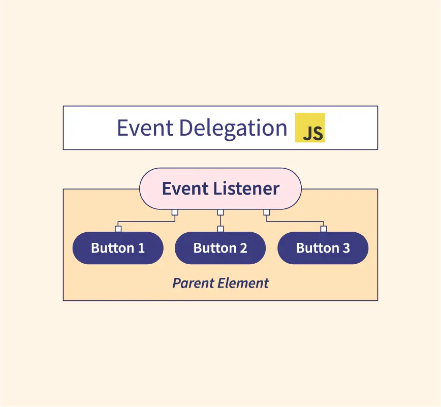

Event Delegation là một kỹ thuật trong JavaScript sử dụng tính năng bubbling (lan truyền sự kiện) để quản lý sự kiện một cách hiệu quả. Thay vì gắn trực tiếp các trình xử lý sự kiện (event listener) vào từng phần tử con, bạn gắn trình xử lý sự kiện vào một phần tử cha chung và sử dụng logic bên trong để xử lý các sự kiện xảy ra trên các phần tử con.



## Cách hoạt động của Event Delegation

1.  **Event Bubbling**: Khi một sự kiện xảy ra trên một phần tử, sự kiện này sẽ "bong bóng" (bubble) lên các phần tử cha của nó trong cây DOM, cho đến phần tử gốc (`document`).

2.  **Lợi dụng Event Bubbling**: Bạn có thể gắn một trình xử lý sự kiện vào phần tử cha. Trong trình xử lý sự kiện này, bạn kiểm tra xem sự kiện bắt nguồn từ phần tử con nào (sử dụng `event.target`) và xử lý sự kiện đó.

```html
<ul>
  <li>Work1</li>
  <li>Work2</li>
  <li>Work3</li>
  <li>Work4</li>
</ul>

<script>
  const listUl = document.querySelector("ul");

  listUl.addEventListener("click", (e) => {
    if (e.target.tagName === "LI") {
      e.target.classList.toggle("active");
    }
  });
</script>
```
