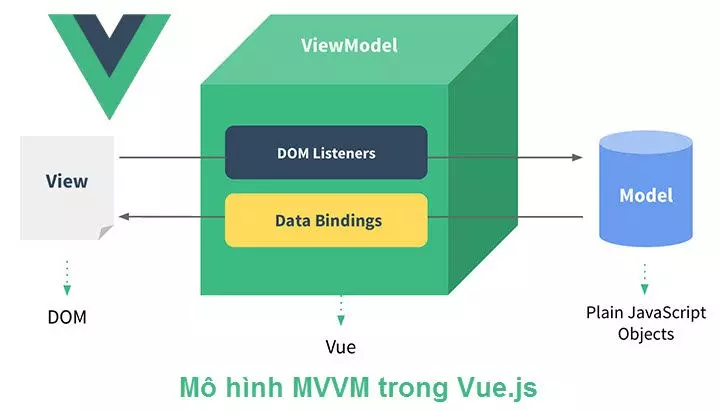

# Tổng quan

Vue.js được phát triển theo mô hình `MVVM (Model-View-ViewModel)`, một kiến trúc thường được sử dụng trong các ứng dụng giao diện người dùng (UI).

### **Giải thích mô hình MVVM trong Vue.js**

1.  **Model**:

    - **Đại diện cho dữ liệu và logic ứng dụng**.
    - Trong Vue.js, `Model` chính là các object trong phần `data` hoặc các biến reactive được định nghĩa trong `Composition API` (Vue 3).
    - Các thay đổi trong `Model` sẽ được phản ánh tự động lên giao diện (View) thông qua hệ thống **reactivity** của Vue.js.

2.  **View**:

    - **Đại diện cho giao diện người dùng (UI)**.
    - Trong Vue.js, `View` được định nghĩa trong phần template HTML (`<template>`).
    - Vue.js sử dụng cơ chế **template syntax** để liên kết (binding) dữ liệu từ `Model` với giao diện.

3.  **ViewModel**:

    - **Lớp trung gian kết nối giữa Model và View**.
    - Trong Vue.js, `ViewModel` chính là **Vue Instance** (hoặc `setup()` trong Composition API). Nó chịu trách nhiệm:
      - Quản lý dữ liệu từ Model.
      - Cung cấp dữ liệu và phương thức (`methods`) cho View.
      - Kích hoạt hệ thống **two-way binding** để đồng bộ dữ liệu giữa View và Model thông qua directive `v-model`.

### **Cơ chế hoạt động của MVVM trong Vue.js**

1.  **One-way Data Binding**:

    - Dữ liệu từ `Model` được phản ánh lên `View`.
    - Sử dụng `v-bind`, `{{ }}` để hiển thị dữ liệu.

2.  **Two-way Data Binding**:

    - Dữ liệu đồng bộ hai chiều giữa `Model` và `View` thông qua `v-model`.

3.  **Event Binding**:

    - Giao diện (View) có thể gửi các hành động của người dùng lên `ViewModel` thông qua `v-on` hoặc các event handler (`@click`, `@input`).

4.  **Reactivity**:

    - Vue.js sử dụng một hệ thống phản ứng (reactivity system) để tự động theo dõi các thay đổi trong `Model` và cập nhật `View` tương ứng mà không cần thao tác thủ công.
