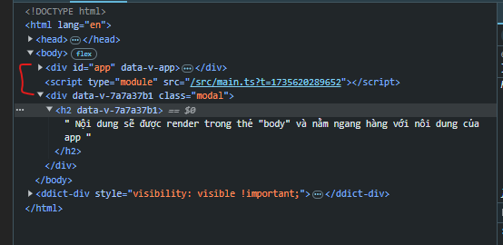

# Teleport

`Teleport` là một **component đặc biệt** trong Vue 3, cho phép bạn **render nội dung của một component** (hoặc một phần của nó) ở **một vị trí khác trong DOM**, thay vì bị giới hạn trong cây DOM của component cha.

Điều này rất hữu ích trong các trường hợp cần đưa một phần tử ra ngoài cấu trúc DOM hiện tại, chẳng hạn như: **modal**, **tooltip**, **dropdown**, hoặc bất kỳ nội dung nào cần hiển thị trên toàn màn hình mà không phụ thuộc vào vị trí trong DOM.

```html
<template>
  <Teleport to="body">
    <div class="modal">
      <h2>
        Nội dung sẽ được render trong thẻ "body" và nằm ngang hàng với nôi dung
        của app
      </h2>
    </div>
  </Teleport>
</template>
```



- **`<teleport to="body">`**: Chỉ định nơi nội dung sẽ được render (ở đây là trong thẻ `<body>`).
- Nội dung bên trong `<teleport>` được chuyển đến vị trí được chỉ định trong DOM mà không thay đổi logic hay trạng thái.

## Thuộc tính của Teleport

1.  **`to`** _(Bắt buộc)_:

    - Chỉ định CSS selector của phần tử DOM nơi nội dung sẽ được render.
    - Ví dụ:
      - `to="body"`
      - `to="#app-root"`

2.  **`disabled`** _(Tùy chọn)_:

    - Khi được đặt là `true`, nội dung sẽ không được teleport mà render tại vị trí gốc trong cây DOM.

```html
<Teleport to="body" disabled>
  <div>Render tại vị trí ban đầu</div>
</Teleport>
```

## Khi nào nên dùng Teleport?

1.  **Modal hoặc Popup**:

    - Để tránh modal bị ảnh hưởng bởi CSS hoặc các thuộc tính như `overflow: hidden` của cha.

2.  **Tooltip, Dropdown**:

    - Giúp hiển thị chính xác tooltip hoặc dropdown trong viewport, bất kể vị trí của component gốc.

3.  **Thông báo (Notification)**:

    - Đưa các thông báo (toast messages) vào một khu vực cố định như `#notification-container`.

## Lợi ích của Teleport

1.  **Không bị giới hạn bởi cấu trúc DOM**:

    - Nội dung được chuyển đến bất kỳ nơi nào trong DOM mà bạn chỉ định.

2.  **Quản lý CSS dễ dàng hơn**:

    - Giảm thiểu xung đột CSS hoặc ảnh hưởng bởi các thuộc tính của phần tử cha.

3.  **Giữ logic component nguyên vẹn**:

    - Trạng thái, sự kiện, và reactivity của Vue vẫn hoạt động bình thường.

## Các lưu ý khi sử dụng Teleport

1.  **Element đích (target)**:

    - Phần tử mà bạn chỉ định trong `to` phải tồn tại trong DOM. Nếu không, nội dung sẽ không được teleport.

2.  **Hiệu suất**:

    - Teleport không ảnh hưởng đáng kể đến hiệu suất, nhưng hãy sử dụng hợp lý để tránh làm phức tạp cây DOM.

3.  **SEO và Accessibility**:

    - Với các nội dung quan trọng như modal, đảm bảo rằng chúng vẫn được hỗ trợ bởi các công cụ SEO và screen reader, ngay cả khi được teleport.
